# Cloud Based E-Commerce

In this project I developed and deployed a full stack application backed by an AWS Architecture for CI/CD, Hosting, Data Persistance and API Access.

The objective of this project is to bring together all the experience I gather for cloud development into one single project, so the main goal here is integrate every service needed for a complete full-stack application, and not to develop a fully fledge web app (This will come later).

In this README you can find the exact details as to how to implement this exact project.


## App Definition
This web app is a simple E-Commerce where an user can post products that will be available in the main page for other users to see.

The frontend will be developed in React.


## Architecture
This project features:
- Frontend deployed in an AWS EC2 Instance.
- Backend deployed in AWS Lambdas.
- AWS Code Pipeline for CI/CD of the Frontend.
- AWS RDS (MySQL) for persistance of products.
- AWS S3 for persistance of products images.
- AWS API Gateway for routing requests to Lambda.
- Cloud Watch for monitoring of EC2 Instances and Application health.
- Secure Communication using SSL.
- AWS WAF Firewall for securing EC2 instance.


## Requirements
- A simple frontend project ready.
- An AWS Account.

*Note: The development of this project will incur in some services fee even in free-tier (Due to the need of AWS Code Build), its expected to bee less than 1 USD*

*Note 2: The full development cycle might be around 2 to 8 USD (ONLY for the services to be used in the development that might take around 4-6 hours to complete)*

*Note 3: An AWS Account in its 12-moth free period might only incurr in up to 1 USD service fee (From CodeBuild)*

---


# Setup
From here I'll be explaining how to setup each service in AWS to achieve this Full Stack Cloud Based App.

This documentation is divided in sections based on the Service being setup so you can also use this project as some kind of stand alone documentation/reference as to how to setup and interact with each service.


## Considerations
This fully fledge app will require a lot of steps to be completed, I encourage you to read this documentation in order so you don't end up trapped in some bugs down the line.

I also recomend to carefully read each step as some of them (Like setting up the EC2 Instance) might have two or three steps dedicated to them in different stages of the development cycle, some of this is intentional so you can get the idea as to what impact our different setups has on others services / configurations.


*___________________________________________________________________________*


# AWS RDS Setup
Lets begin with the Data Layer of our architecture, for this project we will be using a Relational Database using AWS RDS.

To do this in your AWS Dashboard go to `Aurora and RDS` then click on `Create Database`


## Create Database Setup
Here we will be selecting `Standard Creation`

And select `MySQL` as the engine, make sure you 
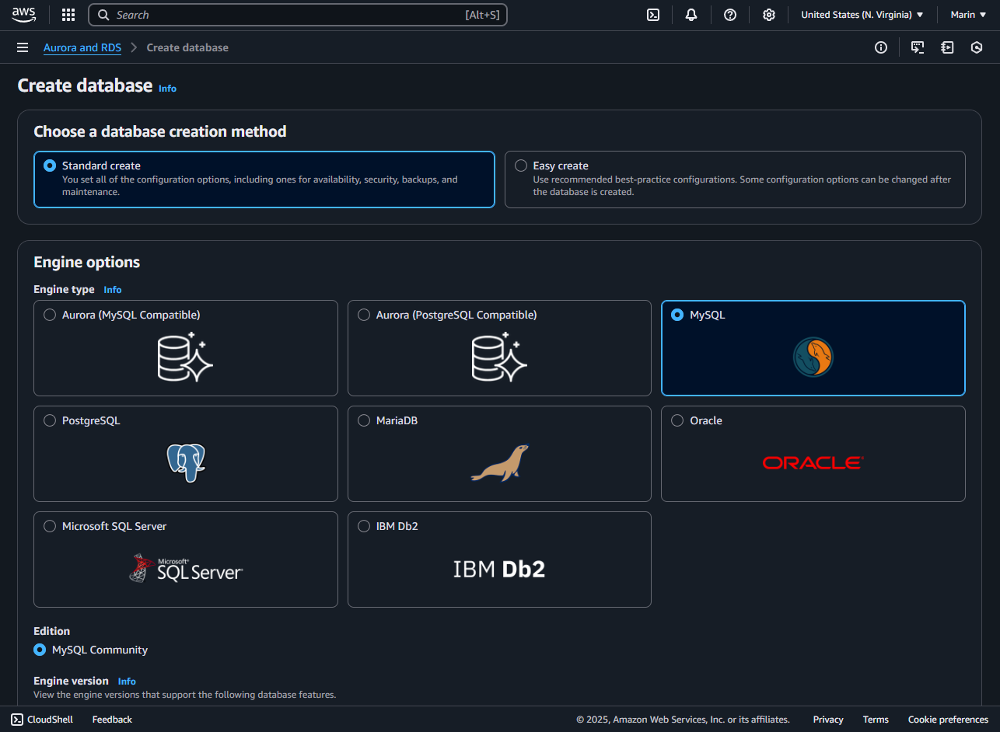

Down below make sure to use the `Free Tier`, this template will setup the database with minimal extra services, making the cost cheaper (Or free if you still have a free tier account)
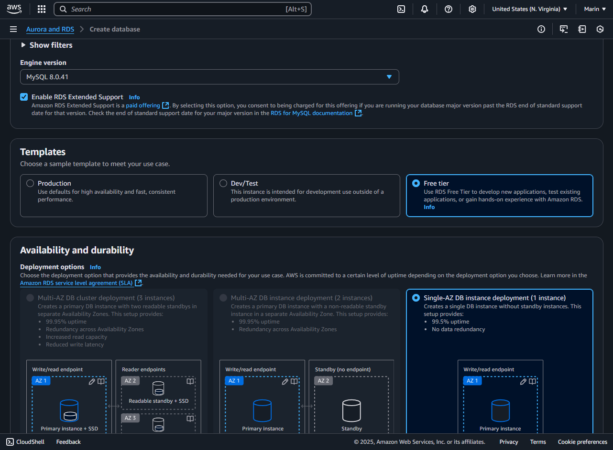

Next, setup the database by attaching a `name` to the ddatabase.

Also in this tab create the `admin credentials`, in this case the user will be `admin` and the credentials will be `self managed` meaning I will access through user and password.

Create a strong enough `password` and confirm it.
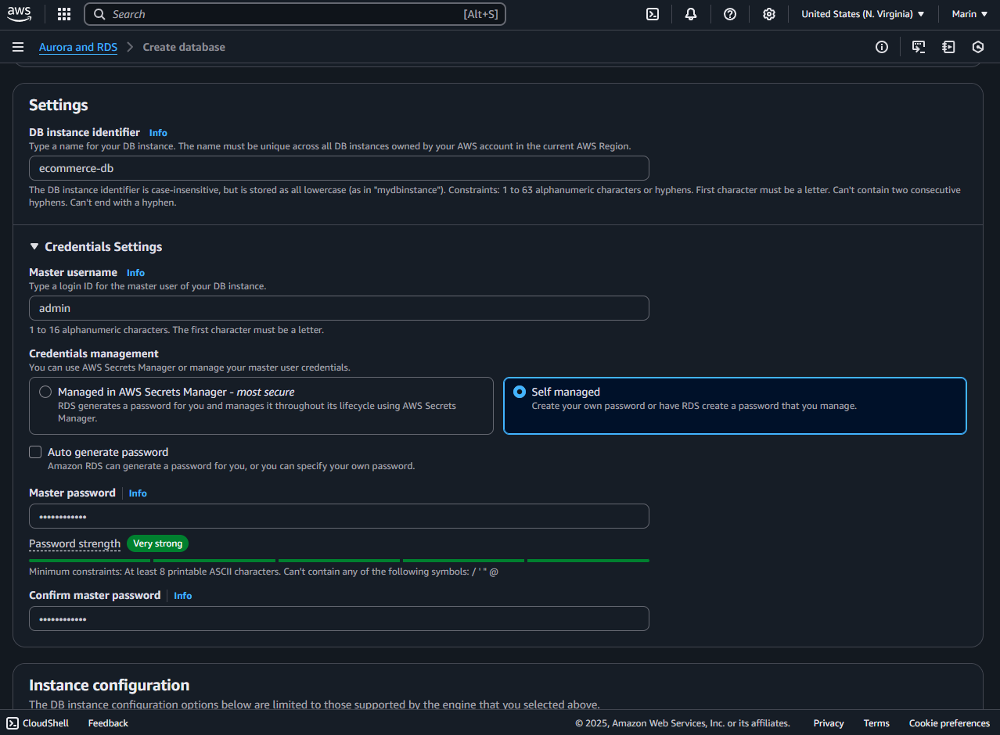

Next select the Instance type, because this is a simple app we wont be needing a strong instance and to keep cost low lets select a basic `db.t4g.micro` instance.

Next in storage make sure the volume is `GP2` and allocate the minimum 20 GB required.
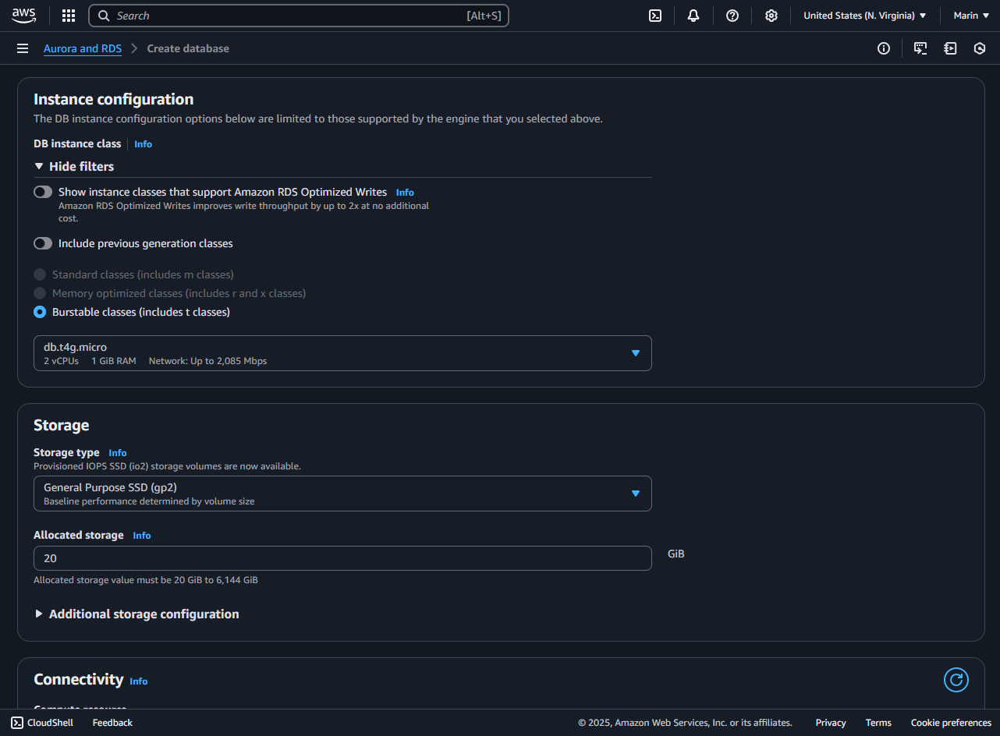

Now in connectivity we do not connect to an EC2 instance, becase we will be connecting using Lambda in this case, and set the Network Type to `IPv4`

Here also select `No` to public access, as we only going to be accessing this database from other AWS Services.
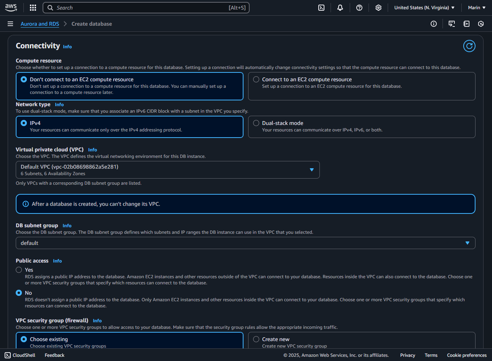

Down bleow make sure to select the `Default` VPC, and make sure its gogint  to be listening to port `3306`
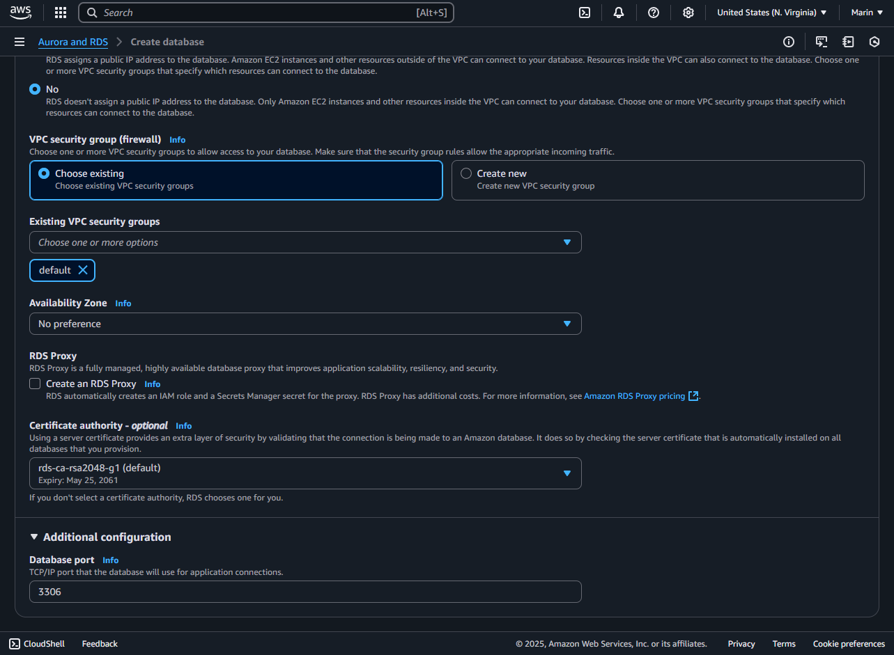

Now lets Tag our database instance, this will help us identify and group all services for this e-commerce app

In tags create a key called `ecommerce` and set the value to `database`

Then select `Password Authentication` for database authentication.
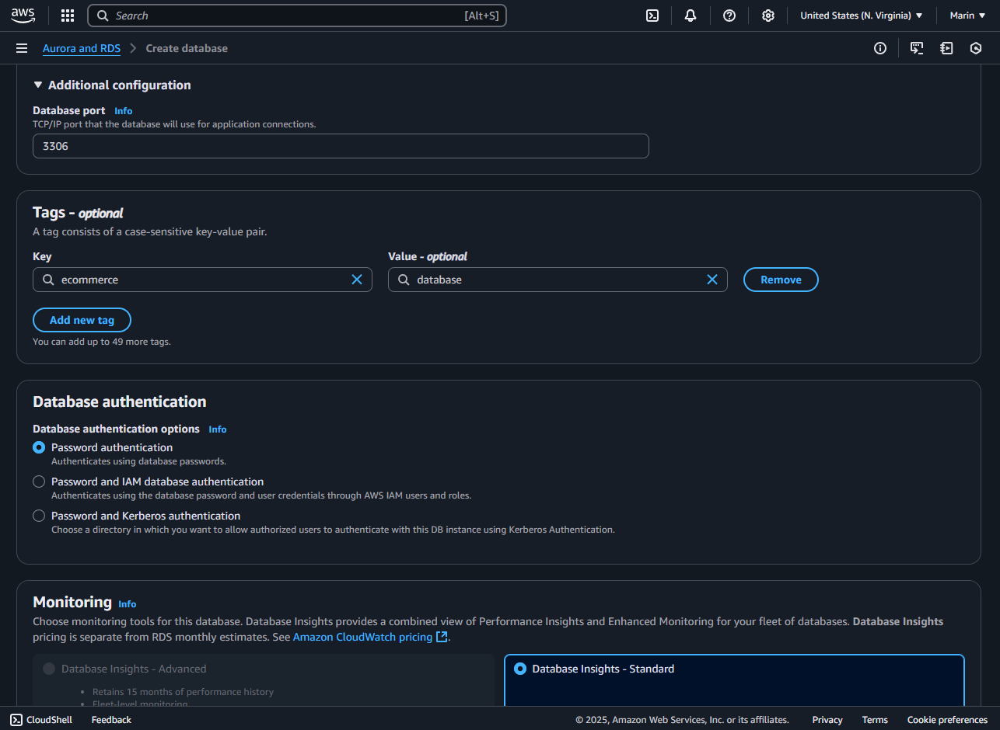

On Monitoring make sure to select `Error Log` and `General Log` so our database instance connects with Cloud Watch to register logs.
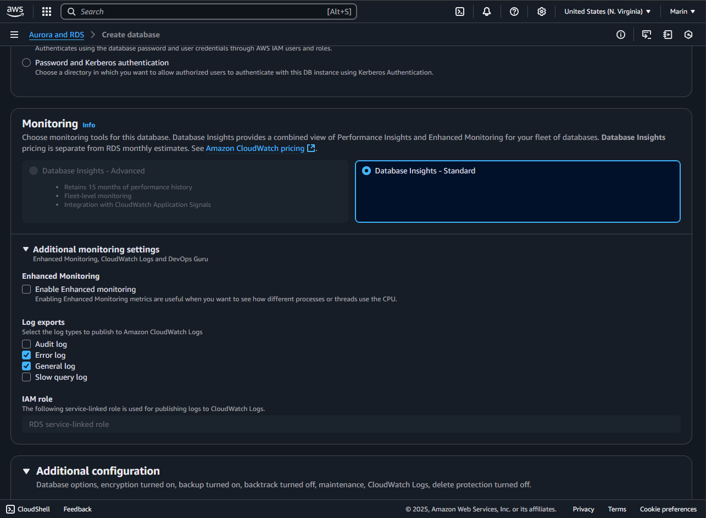

Now down below expand on `Aditional Configurations`.

Here make sure to create a initial database name, I named mine `ecommerce`, if not done, the default database name will be 'mydb', so this is just to add clarity.

Here lets make sure our backup retention period is at least one day, so we have some backup for our data.
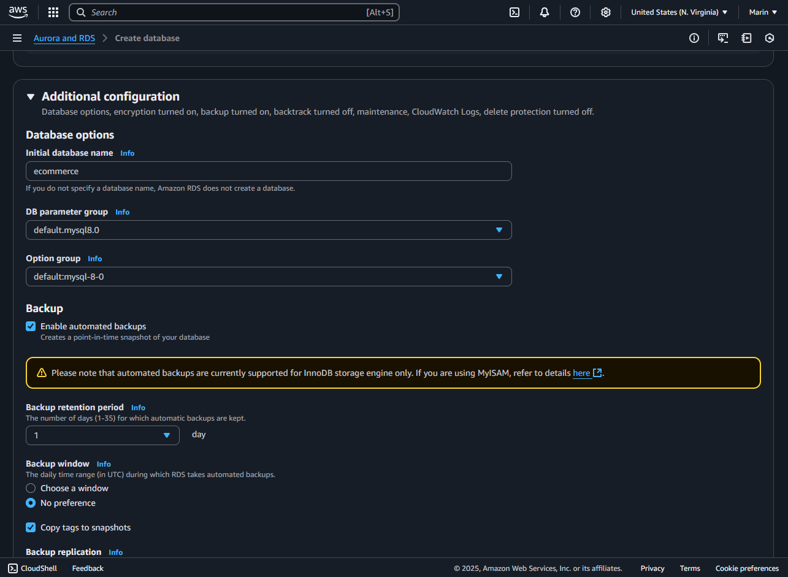

Lastly we will be reviewing the estimated costs of our database

Here you can see that we are still ona free tier, so this database will not incur in any cost fees, then click `Create Database`
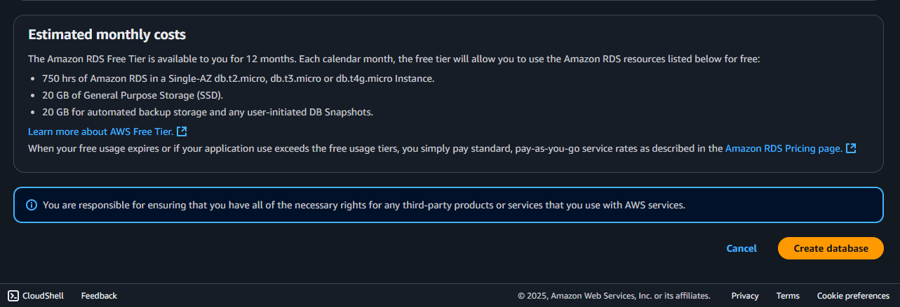

Now wait till the database is created, in the meantime lets continue working on our Data Layer.

## Create a Table
Now that our database is created we need to define our `Table` that all Lambdas will be querying, to do this we will need a GUI like Mysql Workbench or if you are comfortable with, MySQL CLI.

### Allow Public Access to Database
Now we need to `allow public access` temporarily so our connection goes through, this way we can access from our PC using the credentials we created before, from there we can setup our table.

```
Note: This is the least secure way to achieve this but it has ben done for simplicity (And due the database having no data yet).

If you want to securely connect to your database you will need an EC2 instance to act as a middle man to forward our commands to the database.

If you still want to use the MySQL GUI, you can, by binding your Local PC 3306 port to the middleman EC2, and then connect to Workbench via localhost.
```

For  this go to `Aurora and RDS` in AWS Dashboard, then click on the database instance we created then `Modify`

Scroll down to the `Connectivity` section and then expand `Aditional Configurations`

Here click on `Publicly Accessible` and click `Continue`
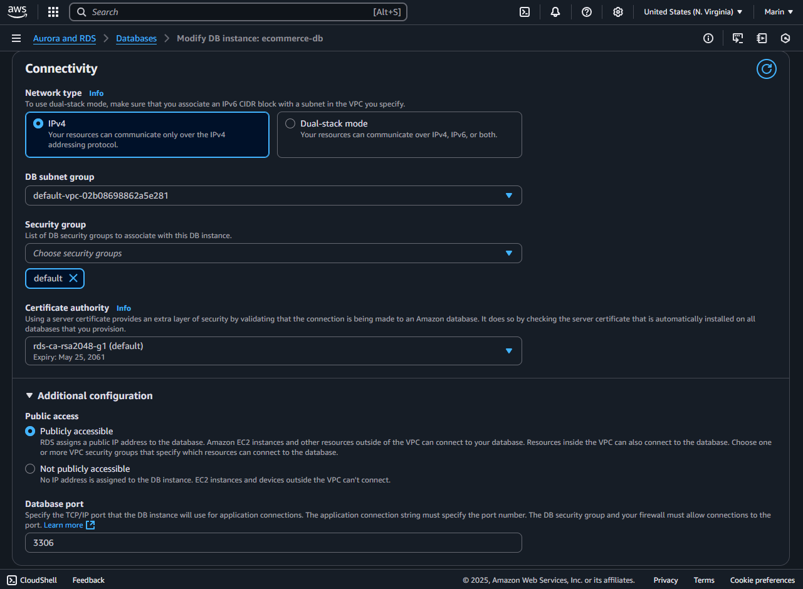

On the next screen make sure to select `Apply Immediately` before clicking `Modify DB Instance`

### Allow MySQL Ports
Now that the database has a public IP, we need to grant access to its port, for this we need to first check the `Security Group` of our DB Instance, in the same screen of the Database, scroll down to `Security Group Rules`.

There check the name of the `Security Group`, then go to `EC2` in the AWS Dashboard

Now in the `EC2` go to `Security Groups` and click on the group name the database had attached.

Then click on `Edit Inbound Rules`

Here click on `Add Rule`, select the `MySQL/Aurora` as the type, and under `Source` select `My IP`
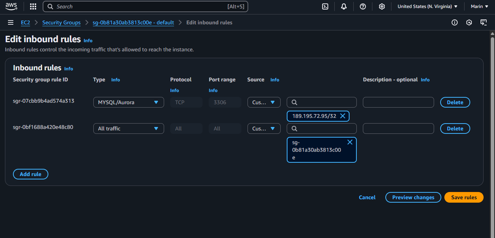

Click `Save Rules`

Now we should have access to our MySQL.

### Connect to MySQL instance Through MySQL Workbench
Now we can connect to our MySQL instance, for this, go to your MySQL Workbench and click on `New Connection`.

Create a name for the conection and set the `hostname` of our instance.

The hostname is in Database dashboard (Where we modify it) under `Endpoint & Port`, take the host and port and paste them here.

Now under `Username` select the username you created in the creation process of the database.

Then click `Store in Vault` and input the password of the user.
*(You can skip this but you will be prompted to put the password each time you want to connect)*
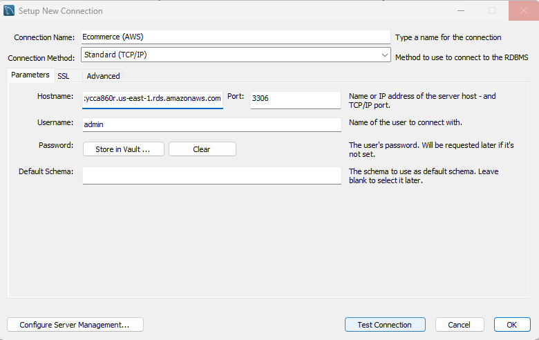


Now select the connection to connect to the database.
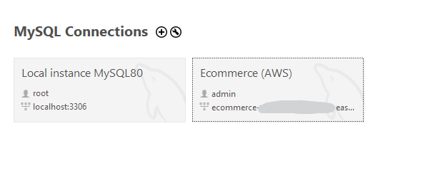


### Create the table
Once in, we should have a database named `ecommerce` or the name you setup in the creation process, now we will be using the next SQL to create the table:

```SQL
use ecommerce;

CREATE TABLE Products (
  id INT AUTO_INCREMENT PRIMARY KEY,
  name VARCHAR(255) NOT NULL,
  description TEXT,
  price DECIMAL(10, 2) NOT NULL,
  image_url VARCHAR(512),
  created_at TIMESTAMP DEFAULT CURRENT_TIMESTAMP
);
```
*Note: Change {ecommerce} if you used another name*

This should have created the table like this:

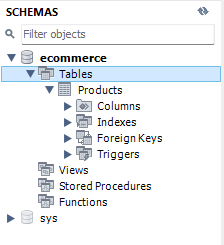

Now everything is ready, lets `undo` the permissions to make our database private again.


## Undo Access
Now, trace back our changes that we just made to grant public access.

Under `Security Groups` go and delete the Inbound rule for MySQL/Aurora

And go to the database instance then `Modify` and select `Not Public Access` to make our database private again.

Now our datbase is private again, in the future if we want to access it we are going to be creating a EC2 instance to work as a secure tunnel.

 
# AWS S3 Setup
Now that we have created our database for the Products Data, we need a way of storing our images for each item, to achieve this we will be using an S3 bucket to store all images.

We will be using the power of presinged urls to create *'upload tickets'* for the images, this way we let the user put their images directly into S3 so we can have a S3 URL in the database.

To achieve this go to `S3` in your AWS dashboard and click `Create Bucket`

Here create a name for the bucket
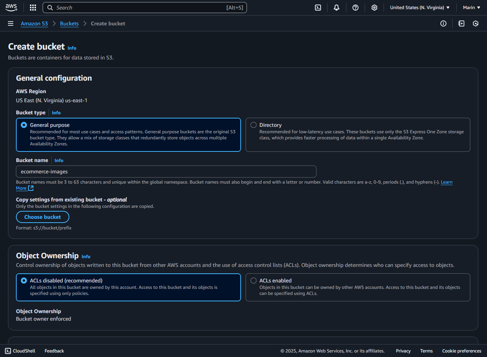

Then scroll down till you see the `Tags`

Here we will be tagging this service too, the tagging serves as a grouping mechanism to all our services, thats why we are using the same key but different value, so on key set `ecommerce` and on value set `s3-images`.
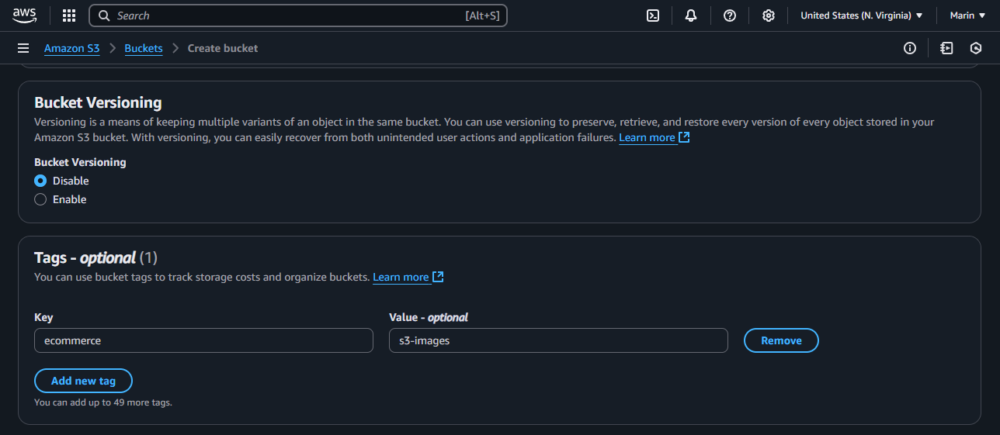

Leave everything else on default and click `Create Bucket`

Now with our S3 created, we now need to grant some permissions to allow users to query the images inse of it.


## Granting Access to S3 files to Users
Now, click on the S3 bucket we just created in your `S3 Dashboard` and go to the `permissions` tab, scroll down to `Block Public Access` and click `Edit`.

Here make sure to uncheck `Block all public access` and none of the checkboxes below should be active, then click `Save Changes`
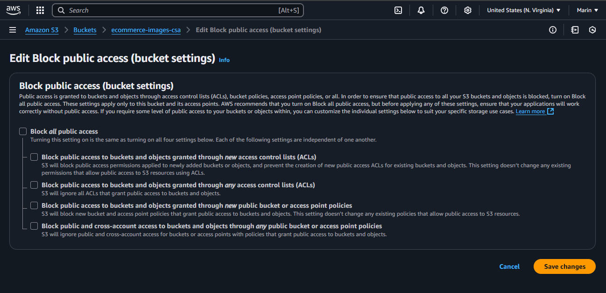

This allows the configuration of policies for public access to this S3 bucket.

Now, on the same screen, scroll down to `Bucket Policy` then `Edit`

In this screen we will be granting access to all files using our permissions object like this:

This will grant access to ALL files (`/*`) (Read and Write) under the root of the S3 bucket, you can change this behaivour by specifing another directory, but for this case this S3 will only store the images so it's ok.

```JSON
{
    "Version": "2012-10-17",
    "Statement": [
        {
            "Sid": "AllowPublicReadPublicFolder",
            "Effect": "Allow",
            "Principal": "*",
            "Action": [
                "s3:PutObject",
                "s3:GetObject"
            ],
            "Resource": "arn:aws:s3:::<BUCKETNAME>/*"
        }
    ]
}
```
*Replace Bucketname with the name of the bucket you just created*

*Note: This setup might cause override of files if they upload the same name and extension, this should be treated before reaching the S3 bucket to prevent collision*

Once added click on `Save Changes`
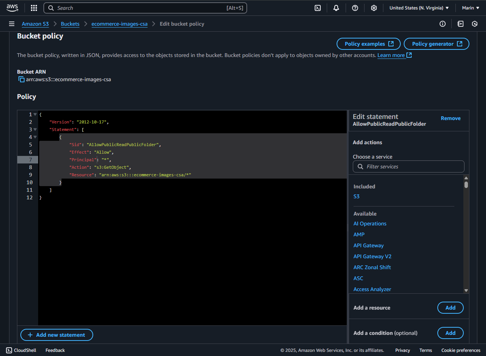


Now our S3 permissions tab should be looking something like this:
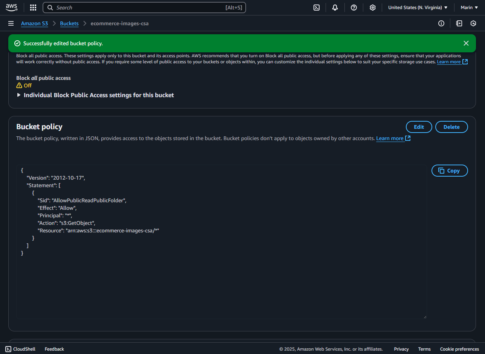


## Enabling CORS
Now, in this setup our users will be putting images directly from the frontend into the S3 bucket, so we need to enable CORS to allow this.

On the same screen as before, scroll down to `Cross-origin Resource Sharing` and click `Edit`.

Here we will be allowing the following methods:
```JSON
[
  {
    "AllowedHeaders": ["*"],
    "AllowedMethods": ["GET", "PUT", "POST"],
    "AllowedOrigins": ["*"],
    "ExposeHeaders": [],
    "MaxAgeSeconds": 3000
  }
]
```
*Note: Once the frontend is deployed we should come here to restrict access to only that origin for better security*

Then click on `Save Changes`.
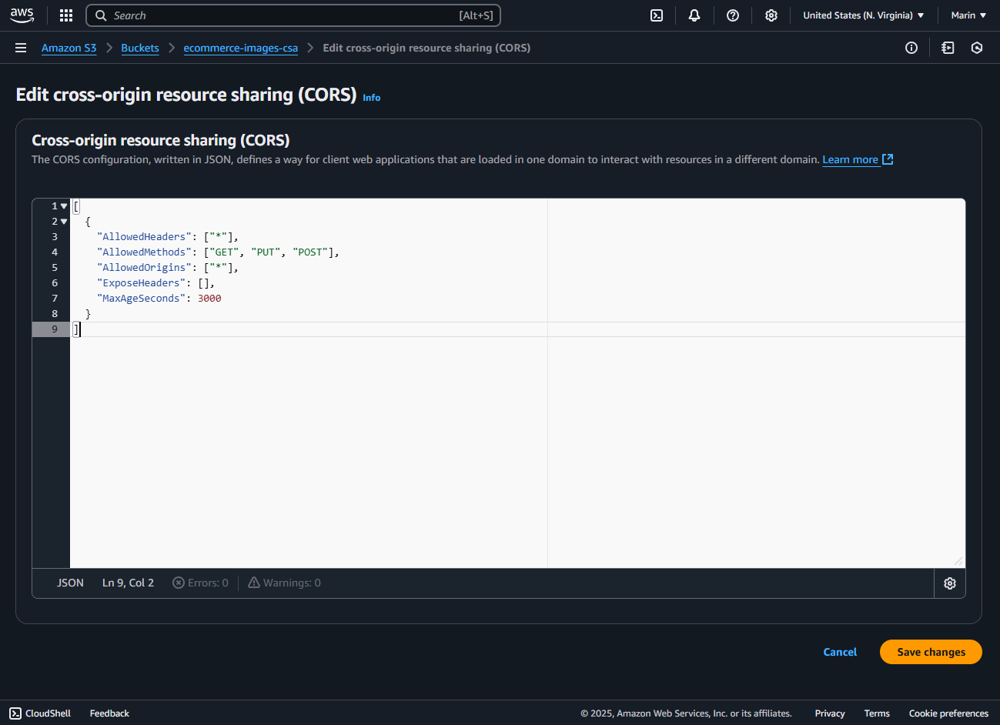


Now our S3 bucket is ready to recieve files and serve them, we will be coding / setting up this functionallity on later steps.


# Lambda Setup
Now that our Data Layer is ready, we will be bring it together using Lambda as our Backend.

We will be creating ONE lambda for each API operation to keep it scalable and manageable.

To do this, in the AWS Dashboard go to `Lambda` and then click on `Create Lambda`, name each lambda and select `Node.js` as the runtime and architecture as `x86_64`

We will be creating 5 Lamdas:
* Create Product.
* Search All.
* Search By ID.
* Delete Product.
* Create Persigned URL (For file upload).

In the Create Function select a name for the Lambda function.
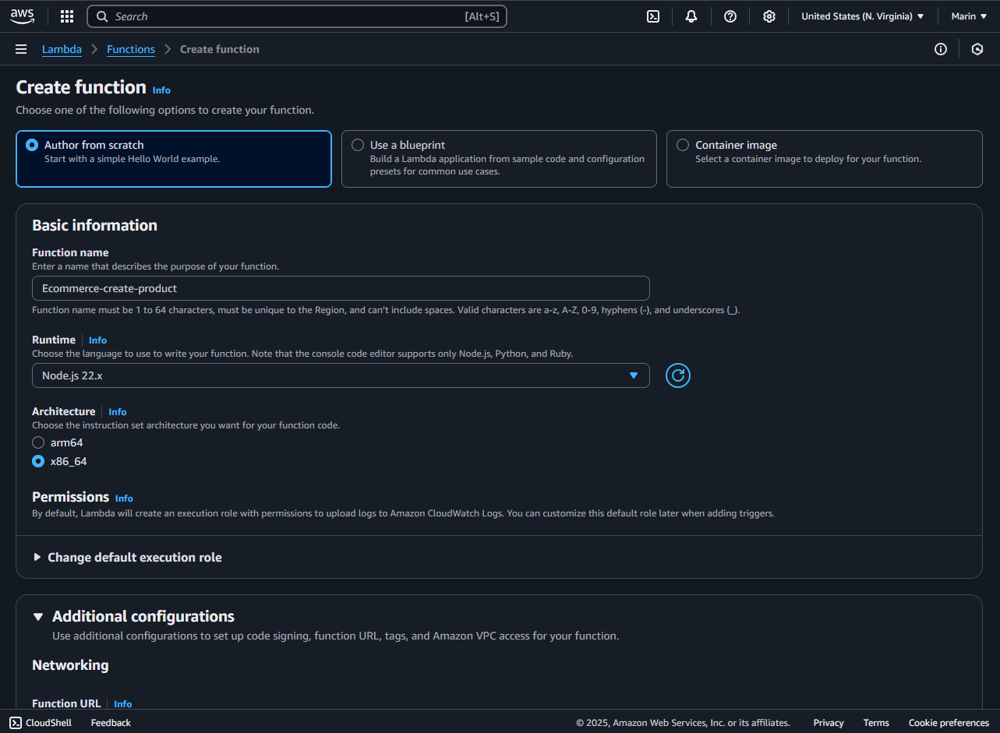

Then scroll down, click on `Aditional Configurations` and make sure to add tags to each lambda with the key `ecommerce` and a value to identify it inside the ecommerce block.
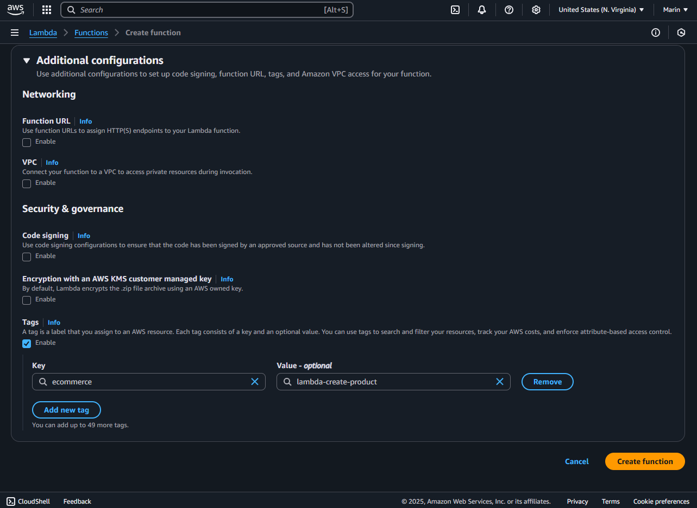

Then click on `Create Function`, repeat this for each function I listed above.


## Setup Layer for Mysql12
Now, before we continue in the development of our lambdas, we are going to create a Lambda `Layer`, these are `Dependencies` our lambda needs to execute its code.

Because we are using MySQL as database and the default AWS SKD that comes with the Lambda Enviroment doesn't come with this package, we need to upload it to our Lambda Layers so all our lambdas can have access to it in a centralized way, avoiding coding repetition.

To do this, to do this `Create` a folder
```BASH
mkdir -p mysql2/nodejs
cd mysql2/nodejs
```

Then inside `nodejs` run:
```BASH
npm init -y
npm install mysql2
```

Then zip the contents of `mysql2` into a `.zip` file.

This means that the .zip file should have at its root the nodejs folder, nothing else.

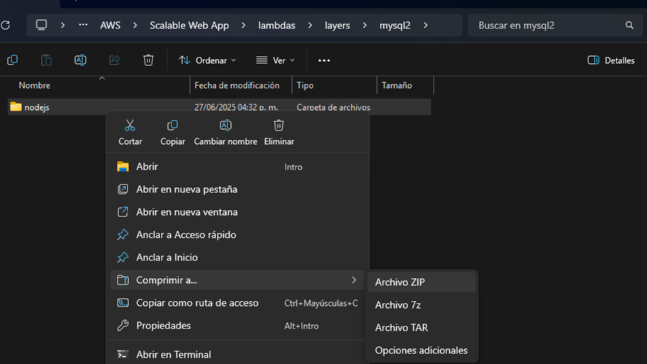

You can name the .zip file as you want.


### Upload Layer
Now that we have our layer, lets upload it to Lambda Layers, for tihs go to your AWS Dashboard, then go to `Lambdas`.

On the left menu go to `Layers` then `Create Layer`

Here name your layer, in this case `mysql2` then `upload the .zip` file we just created.

Optionally add the architecture and runtime of this layer and click on `Create`
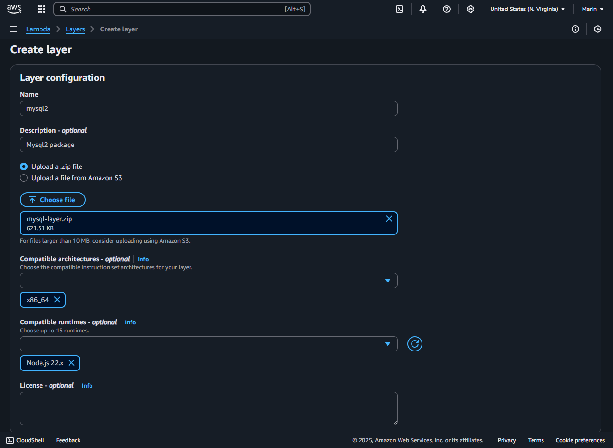

Now our layer is ready to be attached to each Lambda that requires a connection to Mysql, this way we avoid the need of bundling our own node projects for each lambda.

## Setup Create Product Lambda
Now, this lambda is going to connect to our Database to create a new entry in the `Products` table, for this we will be needing the following code:

```JavaScript
import mysql from 'mysql2/promise';

const {
  DB_HOST,
  DB_USER,
  DB_PASS,
  DB_NAME,
  S3_BUCKET,
} = process.env;

exports.handler = async (event) => {
  try {
    const body = JSON.parse(event.body);
    const { name, description, price, imageKey } = body;

    if (!name || !price || !imageKey) {
      return {
        statusCode: 400,
        body: JSON.stringify({ error: 'Missing required fields' }),
      };
    }

    const imageUrl = `https://${S3_BUCKET}.s3.amazonaws.com/${imageKey}`;

    const connection = await mysql.createConnection({
      host: DB_HOST,
      user: DB_USER,
      password: DB_PASS,
      database: DB_NAME,
    });

    const query = `
      INSERT INTO Products (name, description, price, image_url)
      VALUES (?, ?, ?, ?)
    `;

    await connection.execute(query, [name, description || '', price, imageUrl]);
    await connection.end();

    return {
      statusCode: 201,
      body: JSON.stringify({ message: 'Product created successfully' }),
    };
  } catch (err) {
    console.error('Error inserting product:', err);
    return {
      statusCode: 500,
      body: JSON.stringify({ error: 'Internal Server Error' }),
    };
  }
};
```


### Setup Env Variables
Now, this lambda requires some `env` variables to work, to set them up go to the `Configuration` tab inside the Lambda dashboard, then click `Enviroment Variables`, then click `edit`

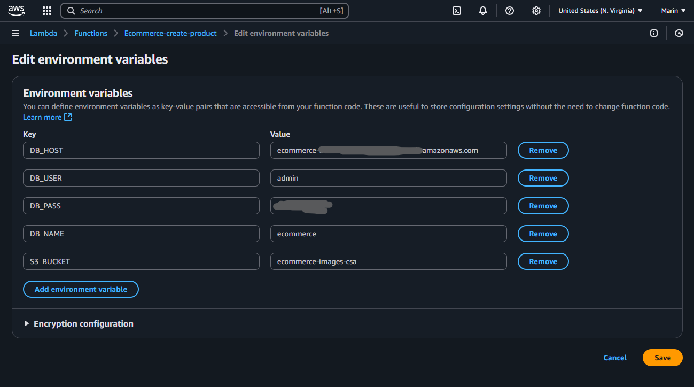

Make sure to set them properly, remember that the host name is called `Endpoint` in the Aurora and RDS dashboard.

Note that the S3_BUCKET is the name of the bucket.

Once setup click `Save`


### Attach MySQL Layer
At this point the lambda is almost ready, we just need to attach the MySQL Layer that we created earlier so it can work without problems, to do this go back to the `Code` section.

Scroll down to the `Layers` section and click on `Add a Layer`

Here select `Custom layer` and look for the layer we created, in this case `mysql2`.

Select the version which it should only have one and then `Add`

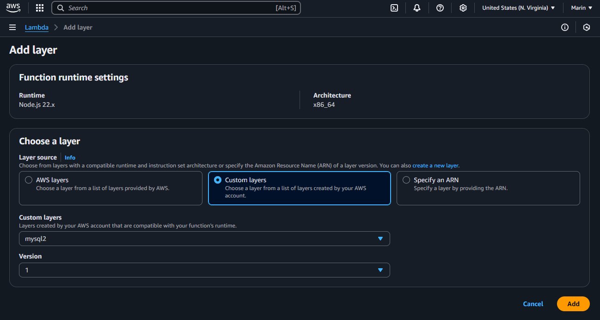


### Attaching Lambda to VPC
Now that we created our lambda we need to add it to the VPC (Virtual Private Cloud), this is our own account private cloud where we have control over the network.

This work by setting up VPC Secure Groups (Firewalls) for allowing traffic through certain ports, now due to the nature of Lambda it does not have a VPC configuration.

We need this VPC configuration to make a connection with MySQL, because our Lambdas need to be on the same network as the MySQL to be able to communicate with each other.

This is achieved by setting up a VPC and attach it VPC Security Groups (Firewalls) that allow Incoming and Outbound traffic through certain ports, in this case 3306, but because we only have this project and our databse is already in a VPC we are only going to attach our Lambdas to the defaults VPC so it can communicate with mysql.

In a bigger cloud, we might need to create a custom VPC, with Custom VPC Security Groups to interconnect our Lambdas with the database directly, making this the most secure approach due to how only a few ports are connected and they can only happen between set services.

To attach a VPC to our lambdas we need to go to the `Configuration` Tab, then go to `VPC` on the left menu, then click `Edit`

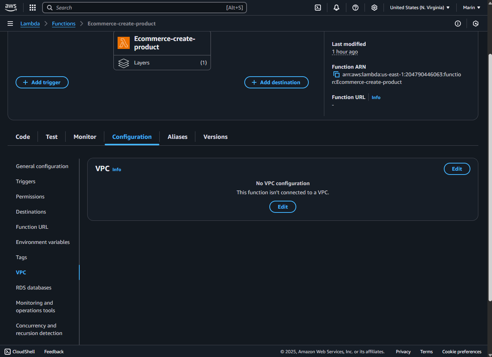

Here we will be selecting the only `VPC` that should be available to us

Then on subnets, select everyone, due to the default configuration of AWS RDS, MySQL should be in all of them.

Then on Security Groups choose the `Default`

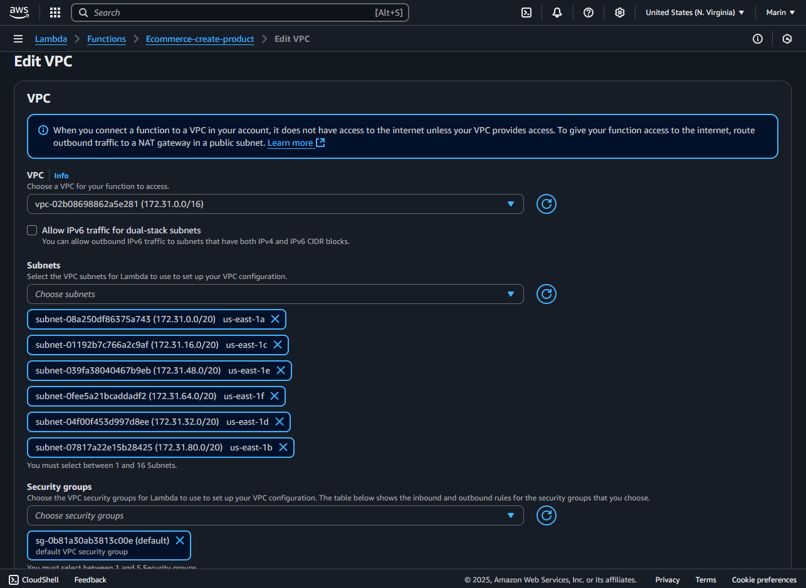

Before saving it, we can make sure our VPC configuration is the one we want (specially if we have multiple VPC, subnets and security Groups), to do this go to the `Aurora and RDS` in AWS, then go to `Databases` and finally click on the database we are using.

Here you can see the VPC, Subnets and VPC Security groups our database is in.

Make sure it aligns with the ones on the VPC.

In this case the Security Group is the default and it has a rule to allow all inbound and outbound connections from within the same security group, this makes so by adding our Lambda to the same VPC (Network) and adding it to the security group (Firewall) it now has reach to our database.

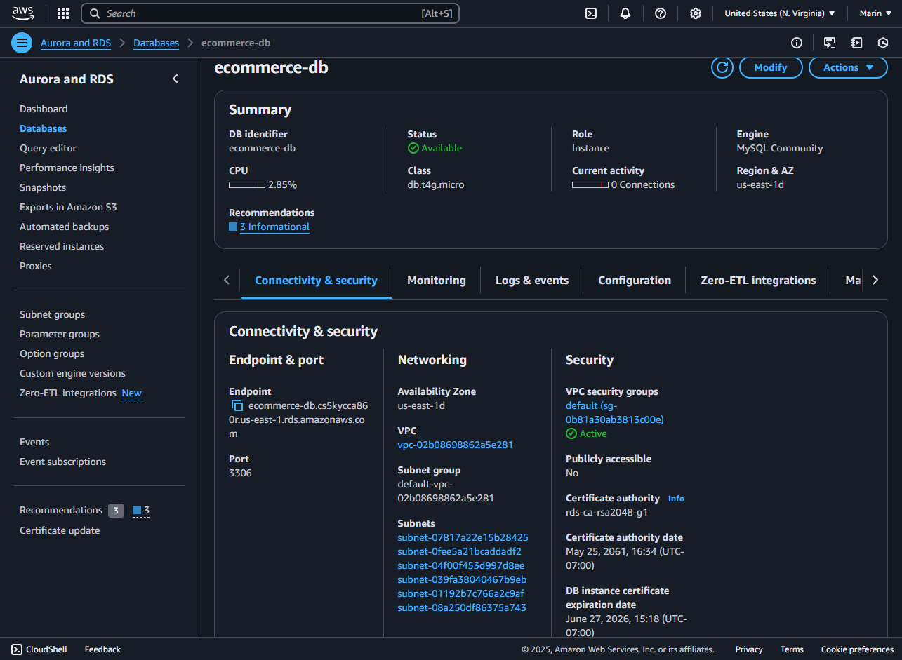

Go back to the Lambda VPC and click `Save`


Go back to the `Code` section and click on `Deploy`


Now this lambda is setup and ready, later we will be attaching it a API Gateway so it responds to HTTP requests.

```
The next setups I'll only be posting the code and some required notes, to avoid polluting this already big README with a lot of 'repeated' photos.
```


## Setup Fetch All Lambda
Now, this lambda is going to be in charge of fetching all products and serve it to our frontend.

The code required is:
```JavaScript
const mysql = require('mysql2/promise');

const {
  DB_HOST,
  DB_USER,
  DB_PASS,
  DB_NAME,
} = process.env;

exports.handler = async () => {
  let connection;

  try {
    connection = await mysql.createConnection({
      host: DB_HOST,
      user: DB_USER,
      password: DB_PASS,
      database: DB_NAME,
    });

    const [rows] = await connection.execute('SELECT * FROM Products ORDER BY created_at DESC');

    return {
      statusCode: 200,
      body: JSON.stringify(rows),
    };
  } catch (err) {
    console.error('Error fetching products:', err);
    return {
      statusCode: 500,
      body: JSON.stringify({ error: 'Failed to fetch products' }),
    };
  } finally {
    if (connection) await connection.end();
  }
};
```
*Note that this lambda does not requires the Bucket env.*

Follow the same steps as before to: `Attach MySQL Layer` and `Add env Variables`


Once done click on `Deploy`.

Now this lambda is good to go.


## Setup Fetch by ID Lambda
Now, this lambda is going to allow us to fetch for a single Product using its ID, ideal for a specific page for a product.

For this we will need this code:
```JavaScript
const mysql = require('mysql2/promise');

const {
  DB_HOST,
  DB_USER,
  DB_PASS,
  DB_NAME,
} = process.env;

exports.handler = async (event) => {
  let connection;

  try {
    const productId = event.pathParameters?.id;

    if (!productId) {
      return {
        statusCode: 400,
        body: JSON.stringify({ error: 'Product ID is required' }),
      };
    }

    connection = await mysql.createConnection({
      host: DB_HOST,
      user: DB_USER,
      password: DB_PASS,
      database: DB_NAME,
    });

    const [rows] = await connection.execute(
      'SELECT * FROM Products WHERE id = ?',
      [productId]
    );

    if (rows.length === 0) {
      return {
        statusCode: 404,
        body: JSON.stringify({ error: 'Product not found' }),
      };
    }

    return {
      statusCode: 200,
      body: JSON.stringify(rows[0]),
    };
  } catch (err) {
    console.error('Error fetching product by ID:', err);
    return {
      statusCode: 500,
      body: JSON.stringify({ error: 'Failed to fetch product' }),
    };
  } finally {
    if (connection) await connection.end();
  }
};
```
*Note that this lambda does not requires the Bucket env.*

Follow the same steps as before to: `Attach MySQL Layer` and `Add env Variables`

Once done click on `Deploy`.

Now this lambda is good to go.

## Setup Delete by ID Lambda
This lambda will be in charge of deleting an entry from the database based on its ID but also of deleting the corresponding S3 image IF there is one attached.

For this wee need the following code:
```JavaScript
const mysql = require('mysql2/promise');
const AWS = require('aws-sdk');

const {
  DB_HOST,
  DB_USER,
  DB_PASS,
  DB_NAME,
  S3_BUCKET,
} = process.env;

const s3 = new AWS.S3();

exports.handler = async (event) => {
  let connection;

  try {
    const productId = event.pathParameters?.id;
    if (!productId) {
      return {
        statusCode: 400,
        body: JSON.stringify({ error: 'Product ID is required' }),
      };
    }

    connection = await mysql.createConnection({
      host: DB_HOST,
      user: DB_USER,
      password: DB_PASS,
      database: DB_NAME,
    });

    // Step 1: Get image key from DB
    const [rows] = await connection.execute(
      'SELECT image_url FROM Products WHERE id = ?',
      [productId]
    );

    if (rows.length === 0) {
      return {
        statusCode: 404,
        body: JSON.stringify({ error: 'Product not found' }),
      };
    }

    const imageUrl = rows[0].image_url;
    const imageKey = imageUrl.split(`/${S3_BUCKET}/`)[1] || imageUrl.split('.amazonaws.com/')[1];

    // Step 2: Delete product from DB
    await connection.execute('DELETE FROM Products WHERE id = ?', [productId]);

    // Step 3: Delete image from S3
    if (imageKey) {
      await s3
        .deleteObject({
          Bucket: S3_BUCKET,
          Key: imageKey,
        })
        .promise();
    }

    return {
      statusCode: 200,
      body: JSON.stringify({ message: 'Product and image deleted successfully' }),
    };
  } catch (err) {
    console.error('Error deleting product:', err);
    return {
      statusCode: 500,
      body: JSON.stringify({ error: 'Failed to delete product' }),
    };
  } finally {
    if (connection) await connection.end();
  }
};
```

Follow the same steps as before to: `Attach MySQL Layer` and `Add env Variables`

Once done click on `Deploy`.

Now this lambda is good to go.

## Setup Create Presigned URL
This lambda will be in charge of creating Pre-Signed URLs to allow the users to upload files directly to the S3 bucket, so they have access to the S3 URL before attempting to save into the database to properly make the relationship.

For this we will need the following code:
```JavaScript
const AWS = require('aws-sdk');

const s3 = new AWS.S3();
const { S3_BUCKET } = process.env;

exports.handler = async (event) => {
  try {
    const body = JSON.parse(event.body);
    const { fileName, fileType } = body;

    if (!fileName || !fileType) {
      return {
        statusCode: 400,
        body: JSON.stringify({ error: 'Missing fileName or fileType' }),
      };
    }

    const key = `uploads/${Date.now()}_${fileName}`;

    const params = {
      Bucket: S3_BUCKET,
      Key: key,
      Expires: 60 * 5, // 5 minutes
      ContentType: fileType,
    };

    const uploadURL = await s3.getSignedUrlPromise('putObject', params);

    return {
      statusCode: 200,
      body: JSON.stringify({
        uploadURL,
        key,
      }),
    };
  } catch (err) {
    console.error('Error generating pre-signed URL:', err);
    return {
      statusCode: 500,
      body: JSON.stringify({ error: 'Failed to generate upload URL' }),
    };
  }
};
```

Now, this Lambda does not require to attach the MySQL Layer and it only requires the `S3_BUCKET` env variable.

Once done click on `Deploy`.

Now this lambda is good to go.

## Grant Access
Now that each lambda is created and ready to serve its functionallity we now need to grant them the required access to each of them to the services they are going to use.

To do this we are going to modify its default `IAM` role that was created alongside them.

For this go to `IAM` in your AWS Dashboard.

Then go to `Roles`, from here we will be accessing each individual Lambda role to grant only the required permissions.

*Note that the naming of the role follows the name of the lambda, and you can also check its `Trusted Entity` with its the type of Service.*

If you follow my naming example I put at the first Lambda, I called each lambda `ECommerce-function-type-` so my lambdas roles are called `ECommerce-function-type-role-#X#X#X#`.

You can also see the name of the role attached to the lambda by going to its dashboard then `Configuration Tab` > `Permissions`, there you will see `Role name`. You can also click the role name and it will send you straight to the role page where we will be editing the role.

Now click on each role to access its details an we will grant them the following permissions:

### Grant Permissions to Create Product Lambda
Serach for the role of this Lambda and click on it.

Once in this Lambda Role dashboard click on the `policy name` that its under Permissions Policy


In the next screen click on `Edit` to edit this Policy.

Here select `JSON` as editor.

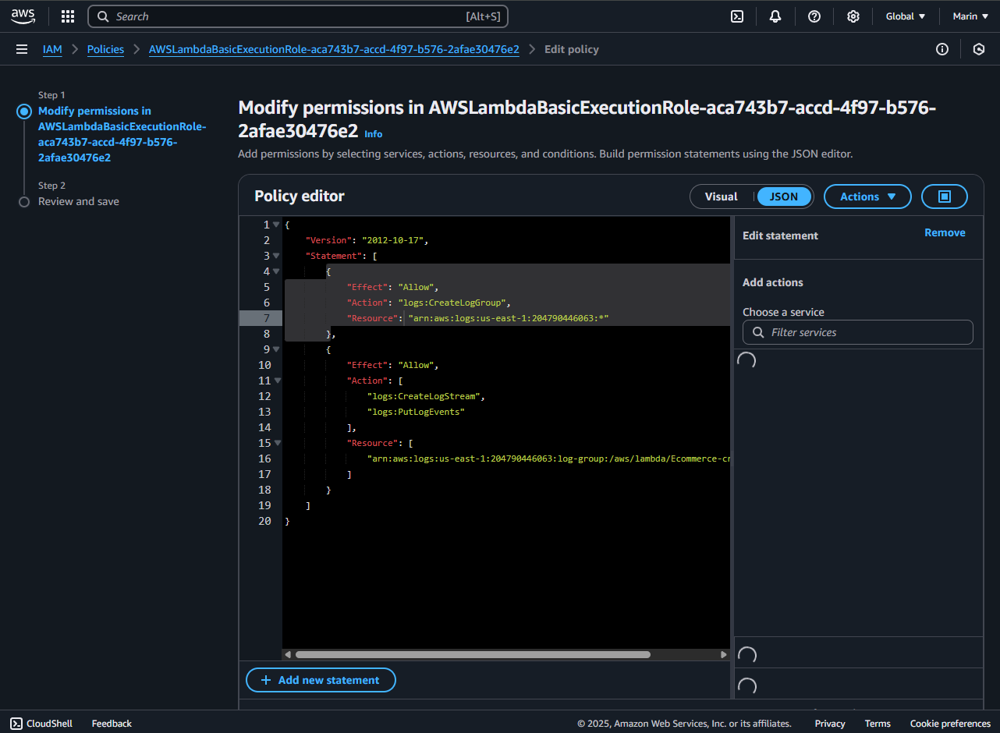

Here we will be granting the permissions to allow connection to our database using the following JSON:

```JSON
    {
      "Sid": "RDSAccess",
      "Effect": "Allow",
      "Action": [
        "rds-db:connect"
      ],
      "Resource": "*"
    },
    {
        "Sid": "AllowVPCNetworking",
        "Effect": "Allow",
        "Action": [
            "ec2:CreateNetworkInterface",
            "ec2:DescribeNetworkInterfaces",
            "ec2:DeleteNetworkInterface",
            "ec2:DescribeSubnets",
            "ec2:DescribeSecurityGroups",
            "ec2:DescribeVpcs"
        ],
        "Resource": "*"
    }
```
*AllowVPCNetworking is what allows our Lambda to connect with MySQL now that it has access to the VPC*

Make sure you insert this in the correct way to keep the JSON format of the policy.

It should be looking like this:

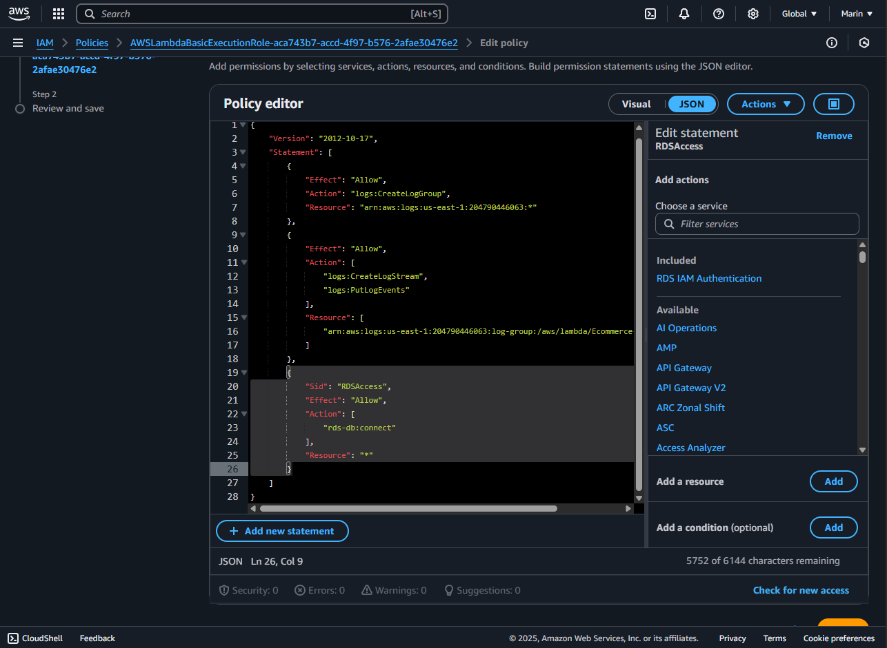

Once insertedc orrectly click on `Next` to review the changes

If everyithing checks up, click `Save Changes`

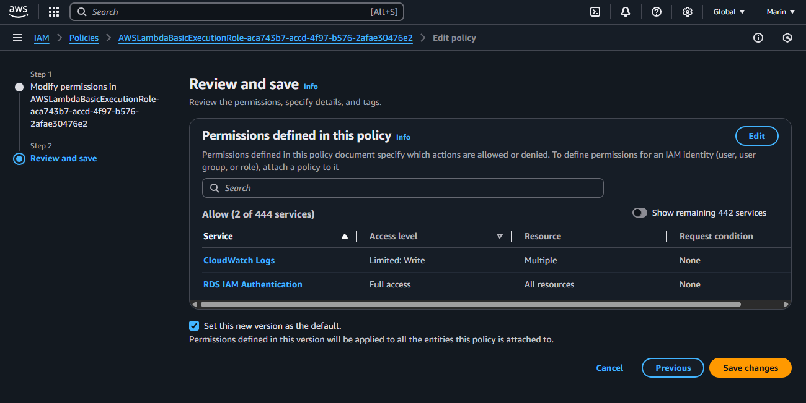

```
I will be skipping the images in the following steps for permissions granting to avoid over pollution of 'similar' images in this README.md.

Just make sure to add the JSON permissions correctly, the editor will tell you if there is something wrong with it.
```

### Grant Permissions to Fetch All Products Lambda
Serach for the role of this Lambda and click on it.

Once in this Lambda Role dashboard click on the `policy name` that its under Permissions Policy

In the next screen click on `Edit` to edit this Policy.

Here we will be granting the permissions to allow connection to our database using the following JSON:

```JSON
    {
      "Sid": "RDSAccess",
      "Effect": "Allow",
      "Action": [
        "rds-db:connect"
      ],
      "Resource": "*"
    },
    {
        "Sid": "AllowVPCNetworking",
        "Effect": "Allow",
        "Action": [
            "ec2:CreateNetworkInterface",
            "ec2:DescribeNetworkInterfaces",
            "ec2:DeleteNetworkInterface",
            "ec2:DescribeSubnets",
            "ec2:DescribeSecurityGroups",
            "ec2:DescribeVpcs"
        ],
        "Resource": "*"
    }
```

### Grant Permissions to Fetch by ID Lambda
Serach for the role of this Lambda and click on it.

Once in this Lambda Role dashboard click on the `policy name` that its under Permissions Policy

In the next screen click on `Edit` to edit this Policy.

Here we will be granting the permissions to allow connection to our database using the following JSON:

```JSON
    {
      "Sid": "RDSAccess",
      "Effect": "Allow",
      "Action": [
        "rds-db:connect"
      ],
      "Resource": "*"
    },
    {
        "Sid": "AllowVPCNetworking",
        "Effect": "Allow",
        "Action": [
            "ec2:CreateNetworkInterface",
            "ec2:DescribeNetworkInterfaces",
            "ec2:DeleteNetworkInterface",
            "ec2:DescribeSubnets",
            "ec2:DescribeSecurityGroups",
            "ec2:DescribeVpcs"
        ],
        "Resource": "*"
    }
```

### Grant Permissions to Delete by ID Lambda
Serach for the role of this Lambda and click on it.

Once in this Lambda Role dashboard click on the `policy name` that its under Permissions Policy

In the next screen click on `Edit` to edit this Policy.

Here we will be granting the permissions to allow connection to our database and also grant access to delete and get items from the S3 bucket using the following JSON:

```JSON
    {
      "Sid": "RDSDeleteAccess",
      "Effect": "Allow",
      "Action": [
        "rds-db:connect"
      ],
      "Resource": "*"
    },
    {
      "Sid": "S3DeleteImageAccess",
      "Effect": "Allow",
      "Action": [
        "s3:DeleteObject",
        "s3:GetObject"
      ],
      "Resource": "arn:aws:s3:::your-bucket-name/*"
    },
    {
        "Sid": "AllowVPCNetworking",
        "Effect": "Allow",
        "Action": [
            "ec2:CreateNetworkInterface",
            "ec2:DescribeNetworkInterfaces",
            "ec2:DeleteNetworkInterface",
            "ec2:DescribeSubnets",
            "ec2:DescribeSecurityGroups",
            "ec2:DescribeVpcs"
        ],
        "Resource": "*"
    }
```

Note that you will need to change `your-bucket-name` with the name of the bucket where the images are going to be.

Here you can also select the folder to where look for it by removing the `*` and setting a path.

### Grant Permissions to Presign Uplaod URL Lambda
Serach for the role of this Lambda and click on it.

Once in this Lambda Role dashboard click on the `policy name` that its under Permissions Policy

In the next screen click on `Edit` to edit this Policy.

Here we will be granting the permissions to allow setting up objects in the S3 bucket using the following JSON:
```JSON
    {
      "Sid": "S3PutPresignedAccess",
      "Effect": "Allow",
      "Action": [
        "s3:PutObject"
      ],
      "Resource": "arn:aws:s3:::your-bucket-name/*"
    }
```

Note that you will need to change `your-bucket-name` with the name of the bucket where the images are going to be.

If you moved your folder not to be root, also modify it here.

---

By this point all our lambdas are ready to go with its logic and permissions created.

Now we are going to expose our lambdas through an API Gateway that will make our lambdas trigger under certain HTTP Requests.

# API Gateway Setup
We are now going to use AWS Api Gateway as an entry point to trigger our lambdas. This Gateway will serve as an REST API.

The setup is as follow:

In your AWS Dashboards go to `API Gateway`, then `Create API`

Then we will be selecting `HTTP API`, click on `Build`

In this screen select a `name` for the API and make sure to add `Integartion` entries for each lambda.

You will be looking at the lambda arn, but it has on it the name of the lambda, so you can look at them by name.

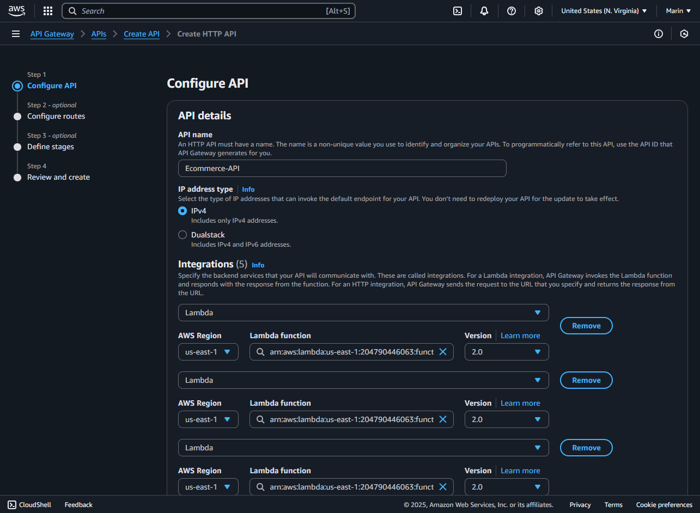

Make sure to select Version 2 and that they are the correct lambdas (If you have multiple).

Then click `Next`

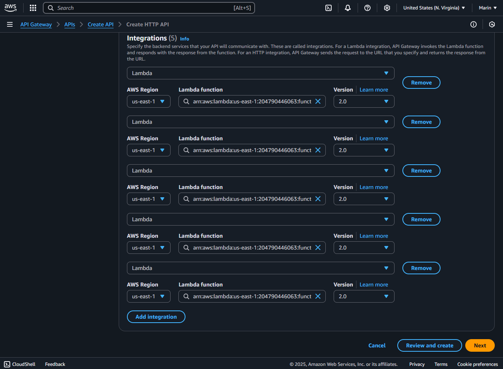

On step 2 we will be defining the HTTP methods and the Endpoints in which our lambdas will be triggered.

Here make sure to select an appropiate HTTP method and that your naming of endpoints follows the basic web structure.

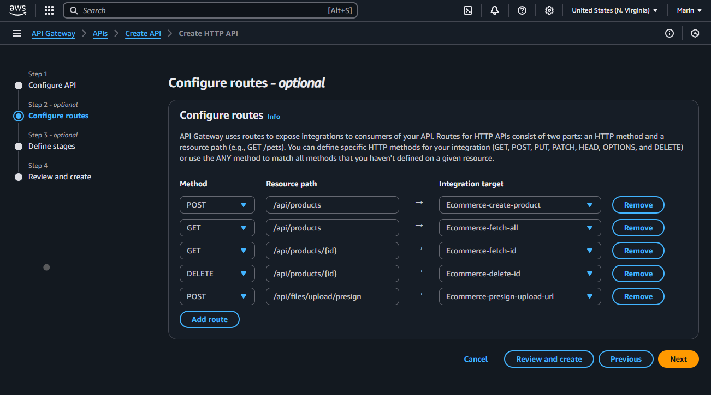

In this case I added:

Create Product
```HTTP
POST /api/products
```

Fetch All Products
```HTTP
GET /api/products
```

Fetch Product by ID
```HTTP
POST /api/products/{id}
```

Delete Product
```HTTP
DELETE /api/products/{id}
```

Presigned URL
```HTTP
POST /api/files/upload/presign
```

In this case the `Delete` and `Fetch by ID` both have an ID as query param, this is required as per the logic we added for those lambdas, because our code is going to be looking for it.

Once done, go ahead and click `Next`

In this screen we will leave it on default, this will make our changes available the moment we made them.

Click `Next`

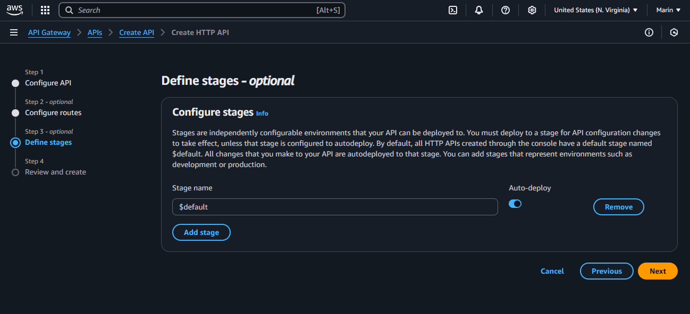

Now review that everything looks good with the integration names of the lambdas and also the routes.

If everything checks out go ahead and click `Create`

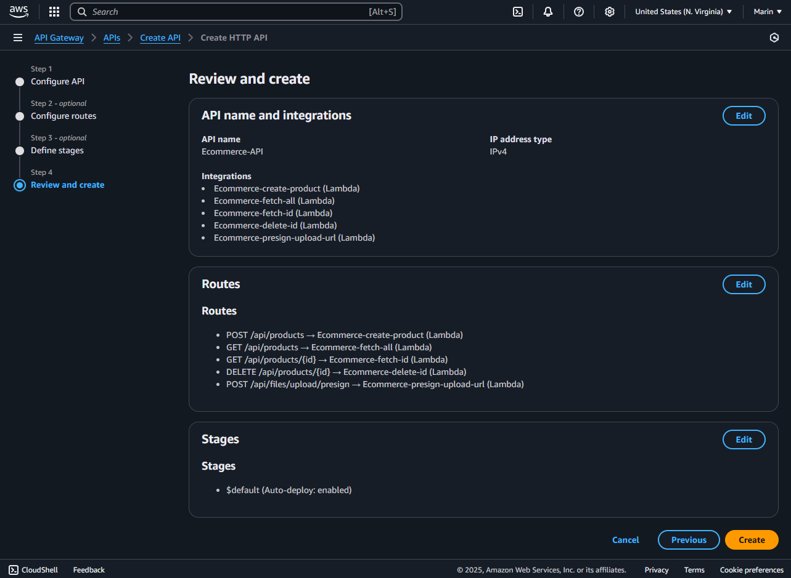

Now our API gateway routes should be looking something like this:

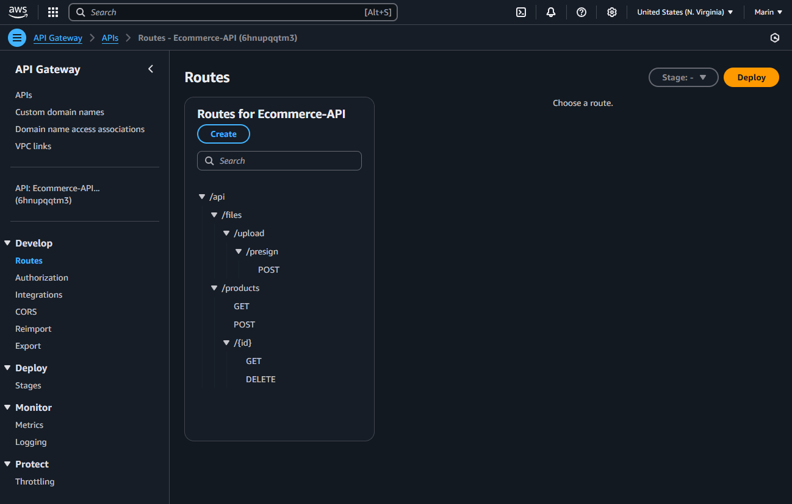

Now lets get our API endpoint so we can make calls to it, to this, click on the name of the API that its in the left side bar.

Here look for the `Default Endpoint`, this where we are going to direct our calls.

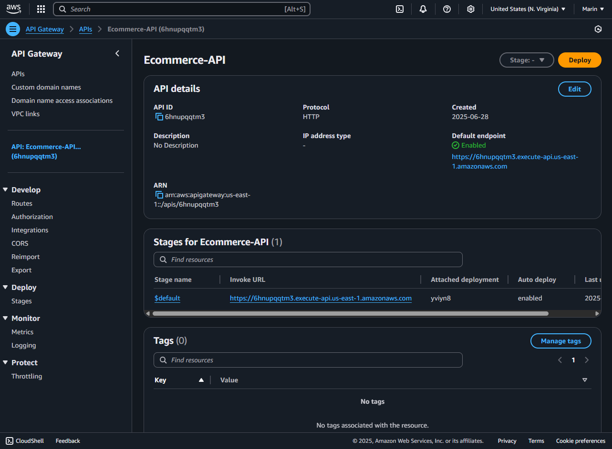

## Early Test
At this point our backend is finished and we should be able to send a request to it and receive a response.

So that's what we are gonna be doing in this point, so use Postman or Curl to send a GET to the /producs endpoint and see what we get.

And as we can see here, we are getting a 200 with an empty array.

Meaning that:
1. Our Database Works
2. Lambda can reach the Database.
3. Our API Gateway is setup properly.

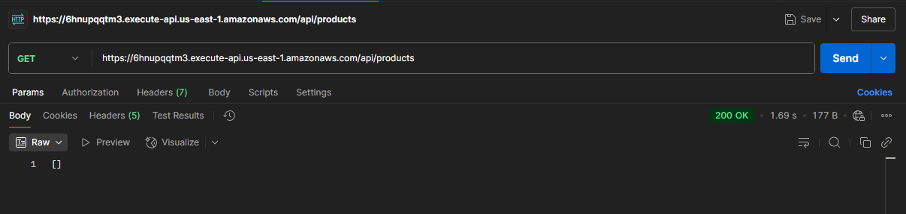

Now that our backend is ready, we now can move to the development of our frontend and setup a nice CI/CD pipeline for it so all changes get posted as soon as they happen.

# Setup CI/CD
At this point our backend is ready, now we will be setting a CI/CD pipeline for our frontend, the frontend is going to be a React app that its going to be built to an optimized production ready package and then its going to be deployed to an EC2 instance that its going to serve as a Web Server.

Next I'll show how to create this pipeline

## Setup a Repository
Setup a repository that its going to hold the code that the pipeline is going to fetch from.

In this case the repository is this same repository, but the pipeline is going to fetch the `/frontend` folder.

Make sure you have a project ready for pushing changes into the repo.

Once setup we are ready to move to the next step.

## Setup an EC2 Instance
We will be deploying our react app to an EC2 instance once is built, for this we will be needing to setup an EC2 instance that will be attached at the end of our pipeline.

To do this in your AWS Dashboard go to `EC2` then `Launch Instance`

In the launch screen add a `Name` to the instance.

For the image select Ubuntu (You can choose AWS Linux but your commands will vary).

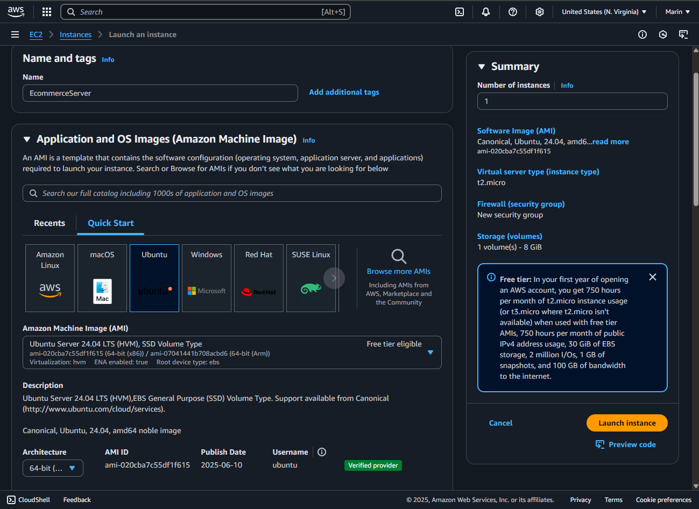

Scroll down and select an `Instance Type`, if available, select the Free Tier Eligible to avoid service fee.

Make sure to `create` a `key pair`, we will be needing them for connecting to our EC2 later for seting up the server.

The key must be `RSA` type and `PPK` format for PuTTY usage, if you have other methods, go ahead and create them as you need.

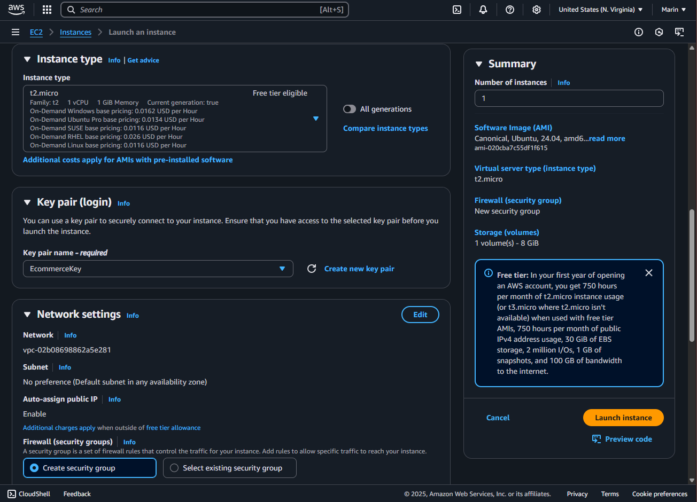

Now down on Network Settings, make sure to select `Allow SSH` , `Allow HTTP` and `Allow HHTPS`, this way our EC2 is going to be ready to accept requests from our users browsers.

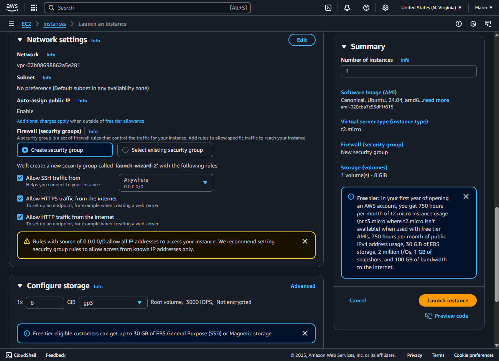

Make sure to select some storage space, 8 is more than enough for this project.

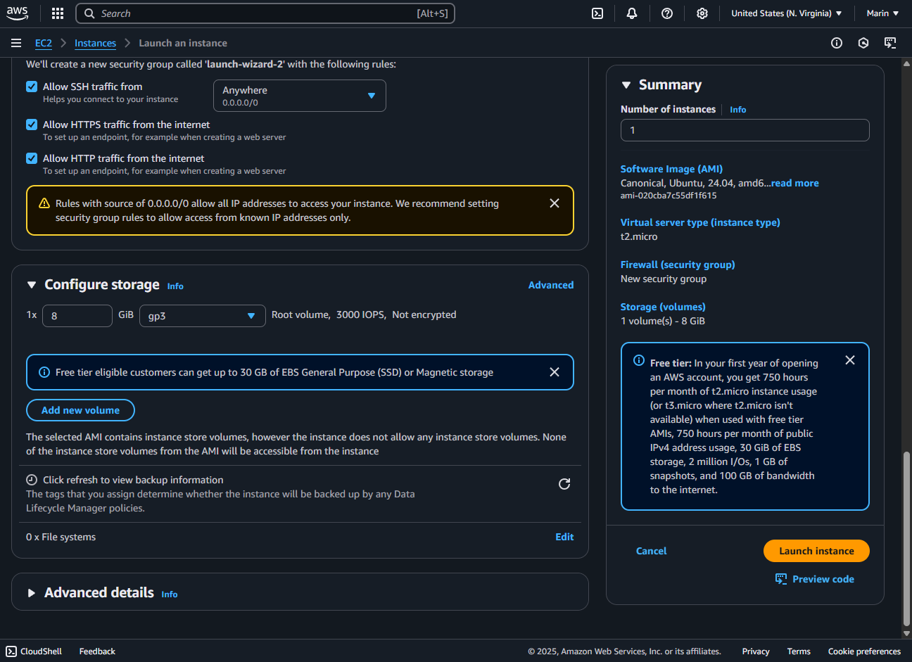

Once done, go ahead and click `Launch Instance`

## Configure the EC2 Instance
With our EC2 instance up and running we now need to connect to it to prepare it for hosting our react app.

To do this, make sure the EC2 instance is up and running, then look for its `Public DNS` by clicking on the Instance inside the `EC2 Dashboard`

Then use some app like PuTTY to connect through SSL.

Remember that for Ubuntu instances in AWS, the user is `ubuntu` so we will be adding `ubuntu@` before the DNS URL when making the connection.

Also remember to add the `PPK` key under `Connection > SSH > Auth > Credentials`, so it grants us access.

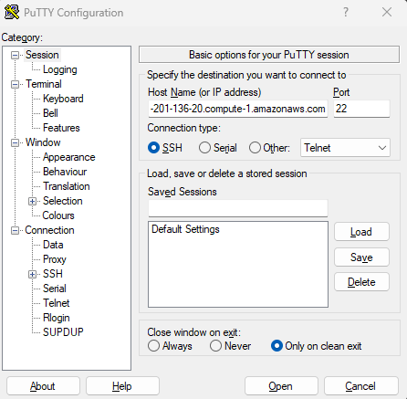

Once connected to our EC2 instance, we need to setup our web server by running some commands and installing the required packages.

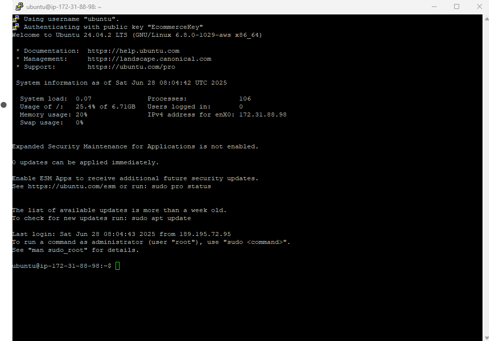

### Prepare EC2 Instance
For this EC2 Instance we will be using `nginx` as our web server, to install it we need to run the following commands:

```Bash
sudo apt update
sudo apt install -y nginx
sudo systemctl start nginx
sudo systemctl enable nginx
```

After runing these comands, we should be able to see the nginx service active by running:

```bash
sudo systemctl status nginx
```

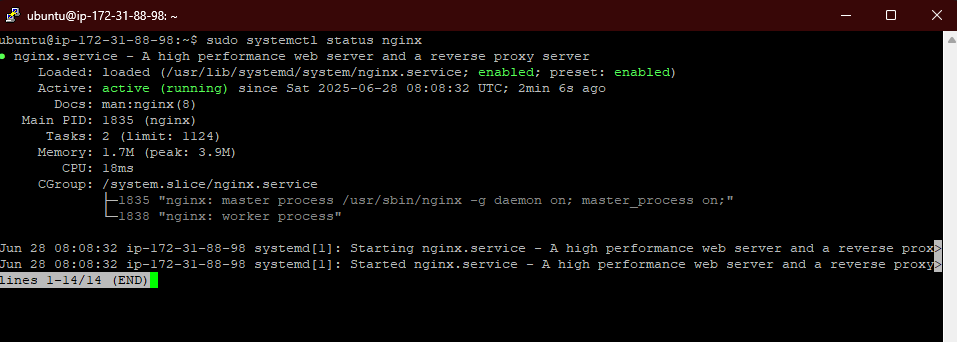


### Setup NGINX
Now that `nginx` is installed and running on our machine, we need to set it up so it can be able to host our react app.

First lets create a folder where our pipeline will put our build.

This command creates a folder and then grants access the current user.

```bash
sudo mkdir -p /var/www/html/ecommerce
sudo chown -R ubuntu:ubuntu /var/www/html/ecommerce 
```

*Note: You can create any folder anywhere, just make sure you set them up accordingly down the line*

Now we need to setup nginx so it has the directives as to how to look and serve our react app.

To do this we need to access its configuration file by runnig this command:

```Bash
sudo nano /etc/nginx/sites-available/default
```

Once inside the file, we need to edit some lines as follows:

```
    root /var/www/html/ecommerce;
    index index.html;

    location / {
        try_files $uri $uri/ /index.html =404;
    }
```

This tells `Nginx` to look for an index.html file inside our ecommerce folder, where the build of the react app will be.

*Note that these settings are somewhere in the file, you'll have to look for them*


Note that we only needed to add /ecommerce at the end of the `root` parameter in this case.

Now press 
`CTRL + X` (Exits the editor)
then input `Y` (Accept saving the changes) and hit enter, 
and then `Enter` again to save the changes (Sets the path, this leaves it intact).

To make sure we made valid changes we can validate our nginx configuration by entering this command:

```Bash
sudo nginx -t
```

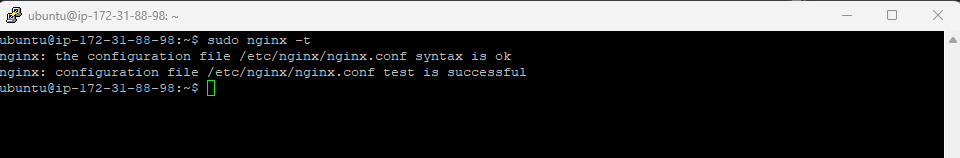

If its ok, then `reload` nginx

```Bash
sudo systemctl reload nginx
```

Now our EC2 is ready to serve our React app files once the pipeline deploys them, take in mind that we need to tell our pipeline to deploy them were we pointed in the nginx config.

But for now we can make sure our server is ready by copying the instance `Public DNS` and copying it in the browser, we should be able to see a Nginx fallback page because as of right now there is no index.html

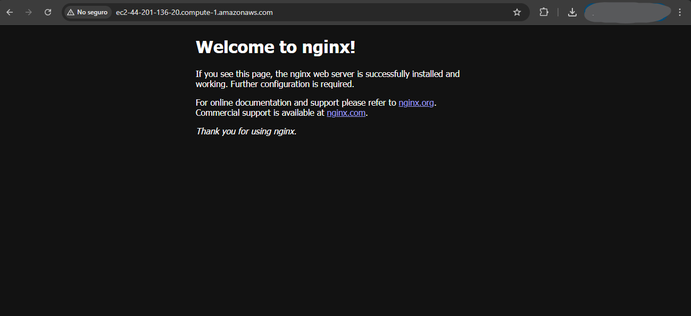

And here it is, this tells us that so far our server is ready and just need our project files to be able to serve them.

### Create IAM Role for Deployment
Next we are going to start off with the CI/CD preparation, first we need to setup some permissions for our EC2 instnace to grant him permissions to work with other systems, mainly the Code Deploy.

To do this got to `IAM` then `Roles` then `Create Role`

Here select `AWS Service` as the Trusted Entity Type.

And as Use Case select `EC2` twice.

Then click `next`

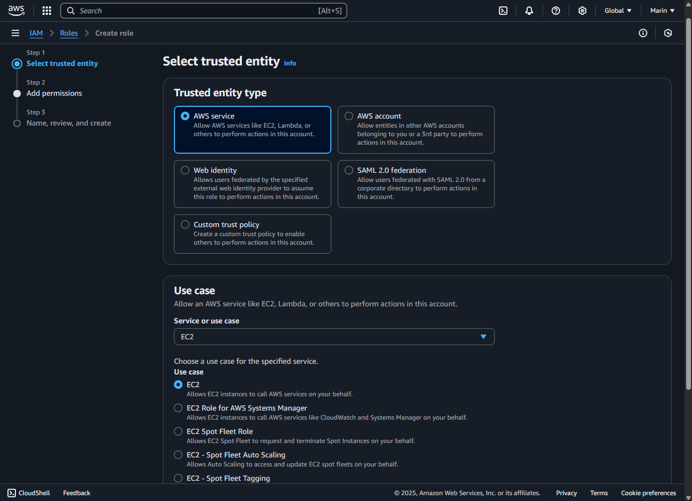

Next lets attach two permissions, use the search bar to look for them:

```
AmazonSSMManagedInstanceCore
```
and

```
AmazonEC2RoleForAWSCodeDeploy
```

Select them by clicking on their checkbox and then click `Next`

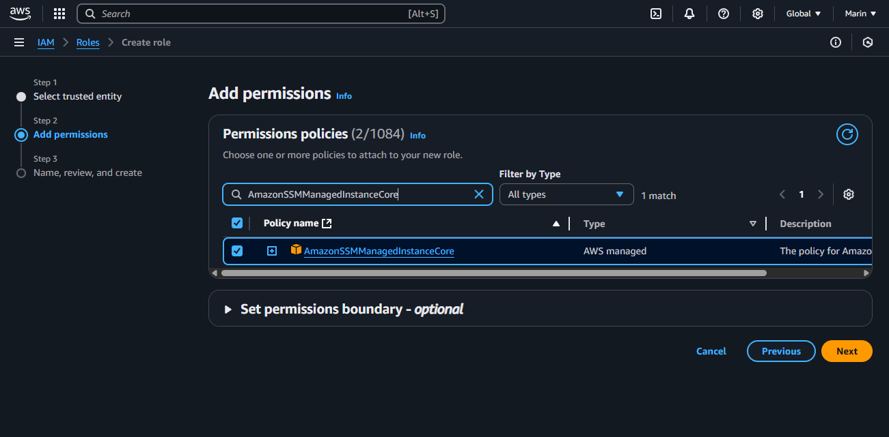

Next lets create a `name` for the role and make sure to review that both permissions are correctly added.

If everything checks up click on `Create Role`

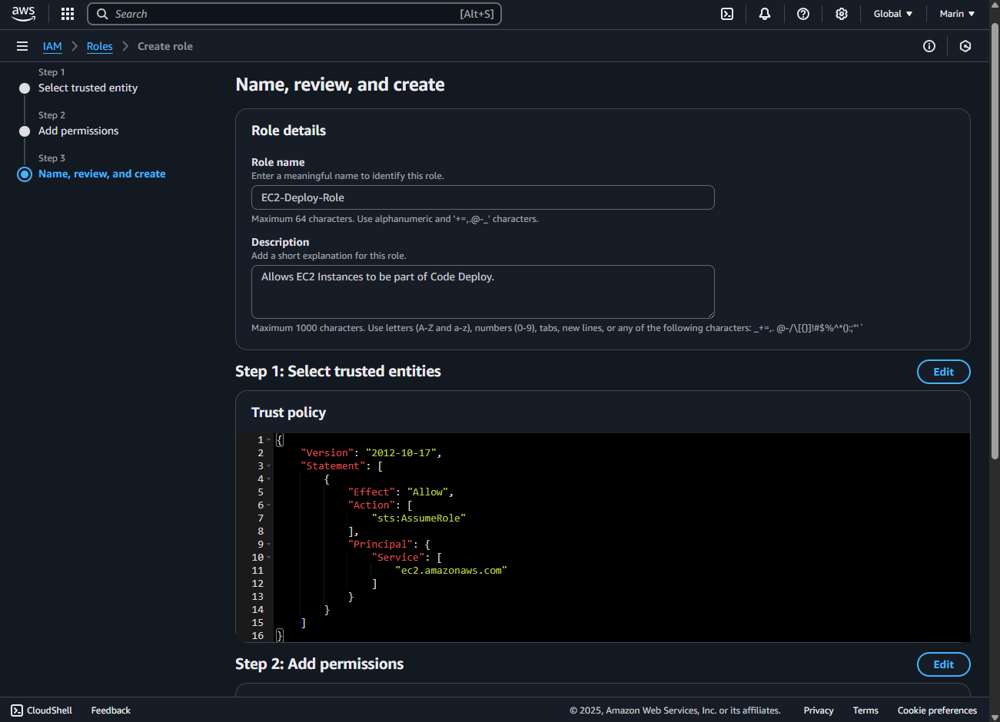

Now we need to attach this role to our EC2 instance to make effect.

### Attaching Deployment IAM Role to EC2

Now go back to EC2 Dashboard and select the Instance where we will be deploying, then click on `Actions` then `Security` then `Modify IAM Role`

Here look for the role we just created and select it, then click `Update IAM Role`

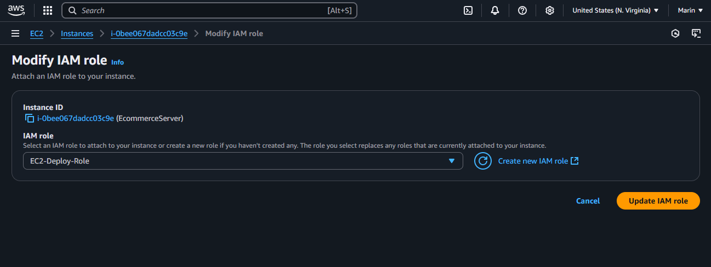

### Installing SSM Agent
Now we need to go back to our EC2 instance to install SSM Agent in our server, this agent its wahat allows interservice communication, meaning it allows the Deploy stage to communicate with EC2 to put the files into it.

To do so we need to run some commands again in the EC2 instance, so we need PuTTY again.


Run these commands to delete ssm-agent that might come pre-installed with the OS, we will be installing the .deb using wget, this is a more stable version

```
sudo systemctl stop snap.amazon-ssm-agent.amazon-ssm-agent.service
sudo snap remove amazon-ssm-agent
```

Change the `<REGION>` placeholders with the region where the EC2 is located at *i.e us-east-1*

```
sudo apt install -y ruby-full wget
wget https://s3.<REGION>.amazonaws.com/amazon-ssm-<REGION>/latest/debian_amd64/amazon-ssm-agent.deb
sudo dpkg -i amazon-ssm-agent.deb
sudo systemctl enable amazon-ssm-agent
sudo systemctl start amazon-ssm-agent
```

```
wget https://aws-codedeploy-<REGION>.s3.<REGION>.amazonaws.com/latest/install
chmod +x ./install
sudo ./install auto
sudo systemctl enable codedeploy-agent
sudo systemctl start codedeploy-agent
```

Now or EC2 is completely ready to be part of the Deployment phase in our pipeline.

## Setup Code Pipeline
Now everything is ready and we are good to go in the creation of the Pipeline for CI/CD.

We will be setting up a Code Pipeline to fetch the code from the repository, Code Build to build the react project and then Code Deploy to push the build to our EC2 server.

To achieve this go to `Code Pipeline` in your AWS Dashboard and then click on `Create Pipeline`.

In step 1 we need to select `Build Custom Pipeline`


Now on step 2:
* Create a name for the pipeline
* Select `queue` in Execution mode
* Let AWS Create a new Service Role

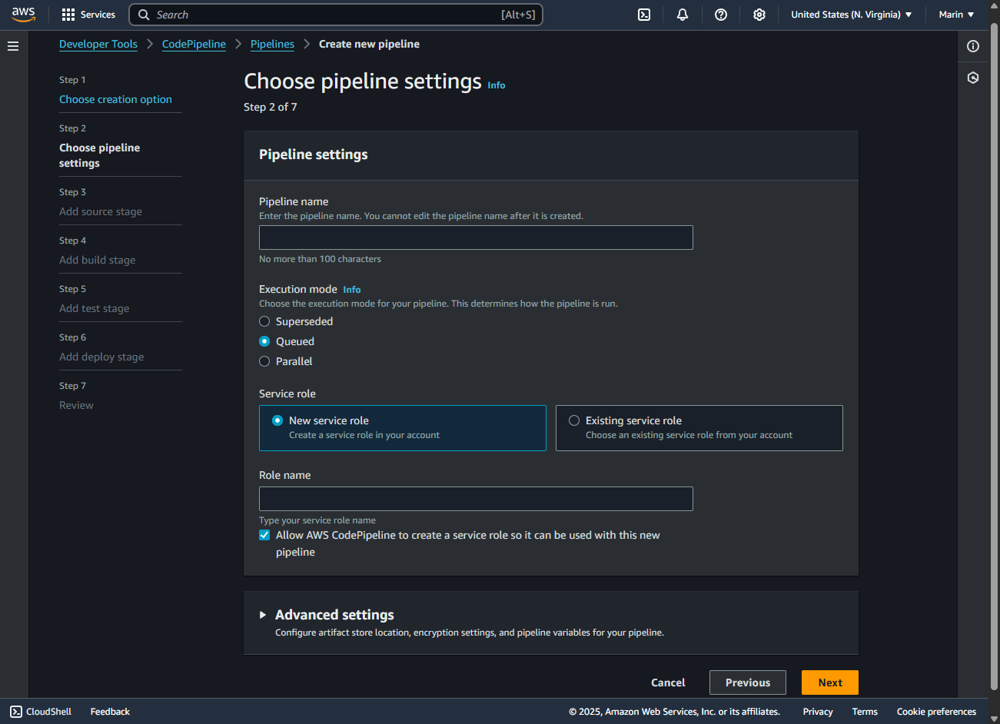

On step 3  we will be connecting to our repository, in this case GitHub.

Click `Source Provider` and select GitHub (Or your repository provider).

Then make sure to select the correct repository and branch from your account.

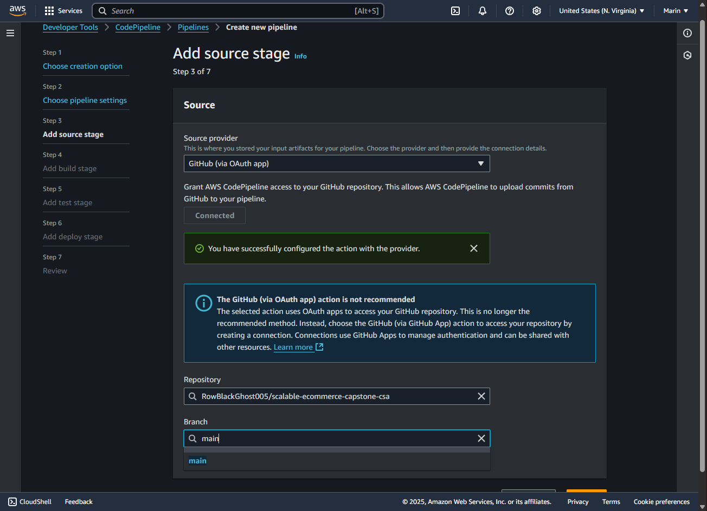

Now in step 4 we will be creating a new AWS Code Build, so go ahead and select `Other Build Providers` then select `AWS Codebuild` and click on `Create Project`

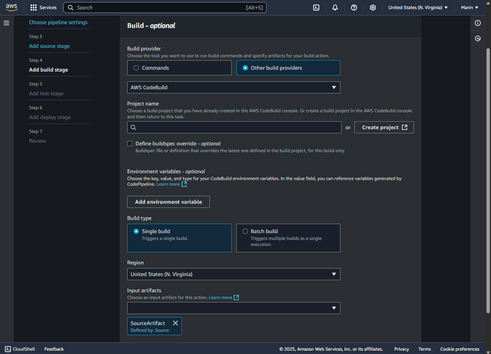

This is going to take us to the Code Build Creation

### Creating AWS Code Build
After the last step a new window should have appeared, here we are going to configure our Code Build.

This is a set of instructions as to how our code from the repository should be built.

Create a `name` for the build and make sure to leave everything on default

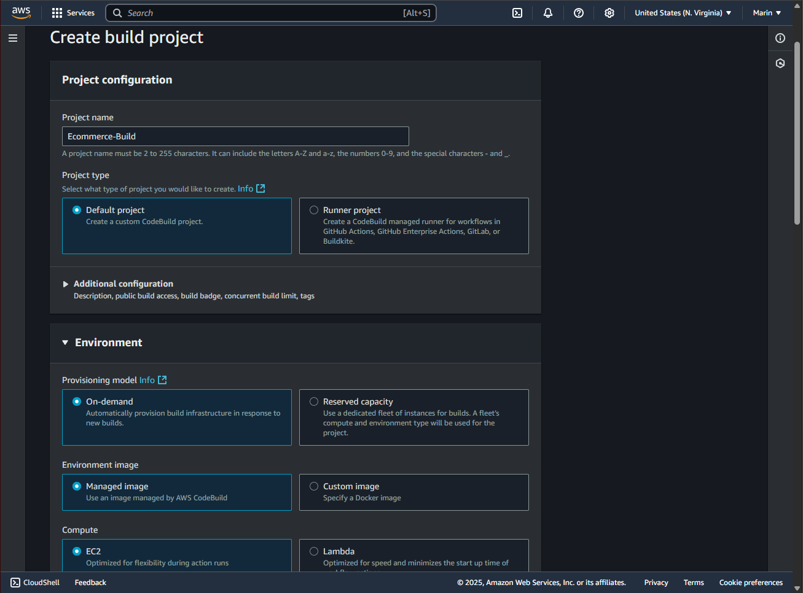

Everything on Enviroment is going to be left on defaults

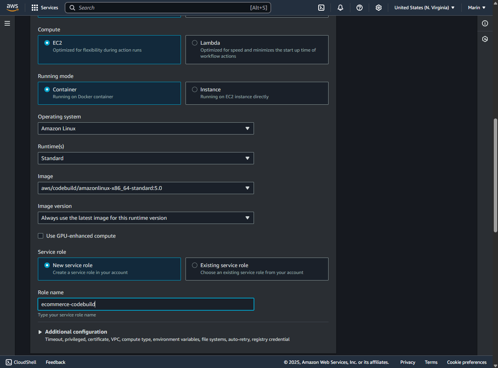

Now on buildspec, make sure to select `Use Buildspec File`.

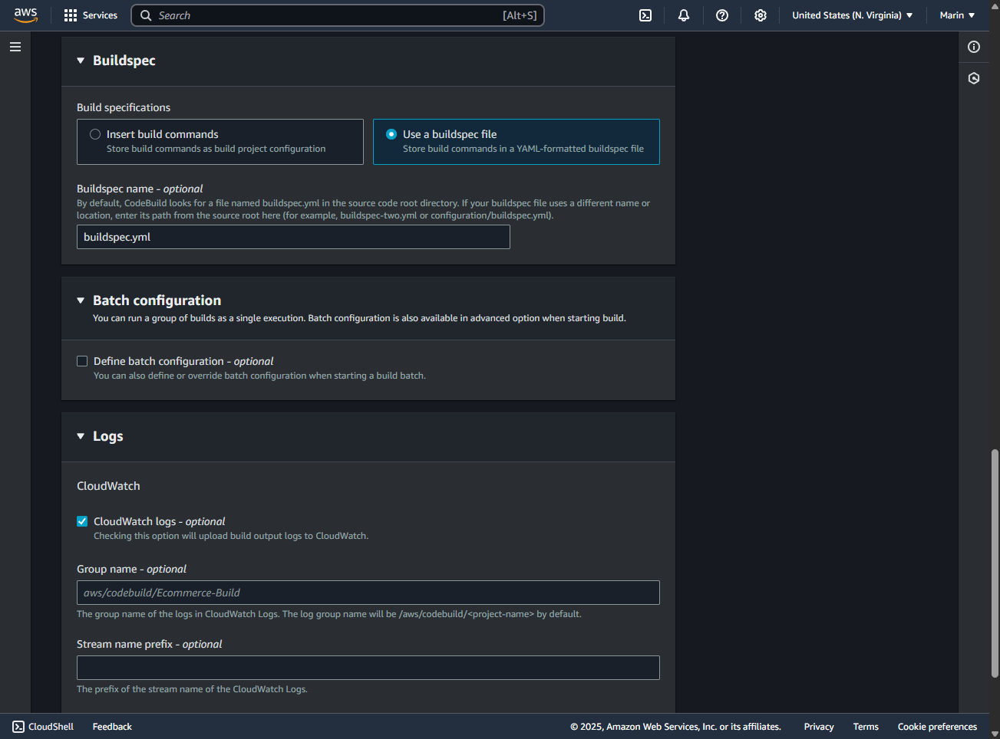

This file is the one that contains all the definitions as to how to build our app, and we are telling it that we are going to provide it.

This file should be in the root of our repository, so `create` a `buildspec.yml` file.

Add the following to it:
```YML
version: 0.2

phases:
  install:
    runtime-versions:
      nodejs: 18
    commands:
      - cd frontend
      - npm install
  build:
    commands:
      - npm run build
  post_build:
    commands:
      - echo "Build completed on `date`"
      - mkdir -p /tmp/deploy
      - cp -r build/* /tmp/deploy/
      - cp ../appspec.yml /tmp/deploy/

artifacts:
  files:
    - '**/*'
  base-directory: /tmp/deploy
```

Make sure this file is in the root of the repository.

Note: Note that we are referencing an /appspec.yml file, this will be created on steps ahead

Skimming through this config you can see that, this process will get the files from `/frontend` on our repo and `run npm install` to get all dependencies.

Then it will `npm run build` to create a build package of our app.

Then it will create a temp folder `/tmp/deploy` and inside of it copies all files inside of `/build` (the one created by npm build)

And then, exposes those files to the next stage as the artifact of this build.

Make sure that `Cloudwatch Logs` is selected, this way we are going to have logs of all build attempts

Then click `Continue to Code Pipeline`
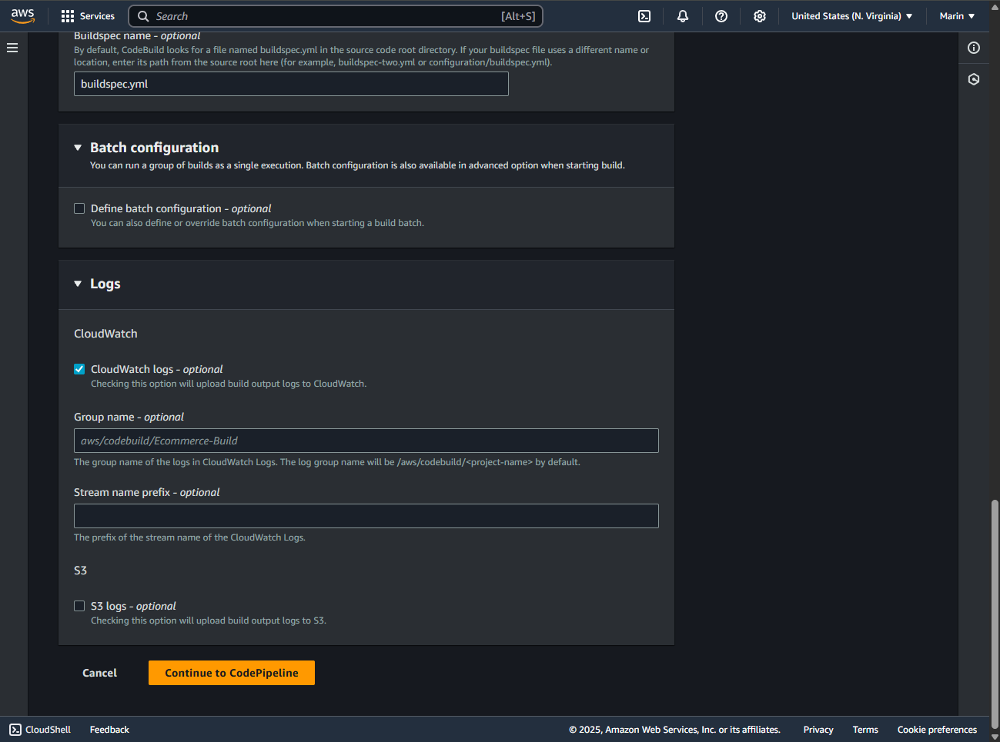

Back at the pipeline setup, make sure the Code Build we created is selected and make sure that the `Input Artifact` is `Defined by Source` (Meaning our repository)

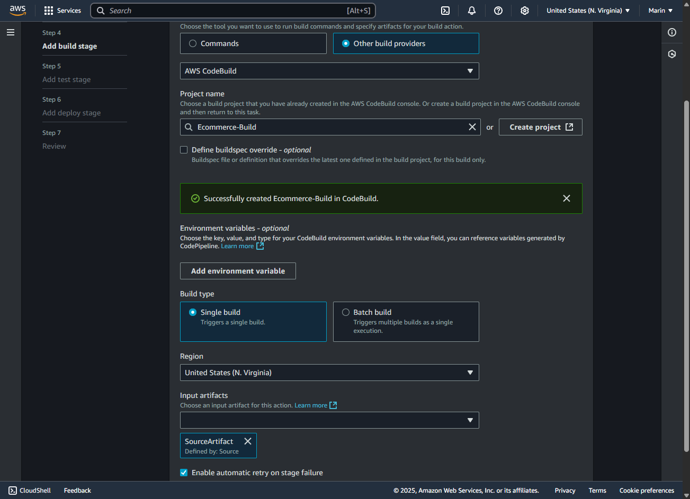

We will be skipping the Test configuration due to not having test at this moment.


On step 6, we will be setting up the Deployment Stage, right now the idea is to deploy directly to an EC2 instance, so that is what will be adding.

Select `EC2` as the `Provider` And make sure the `Input Artifacts` are defined by Build.

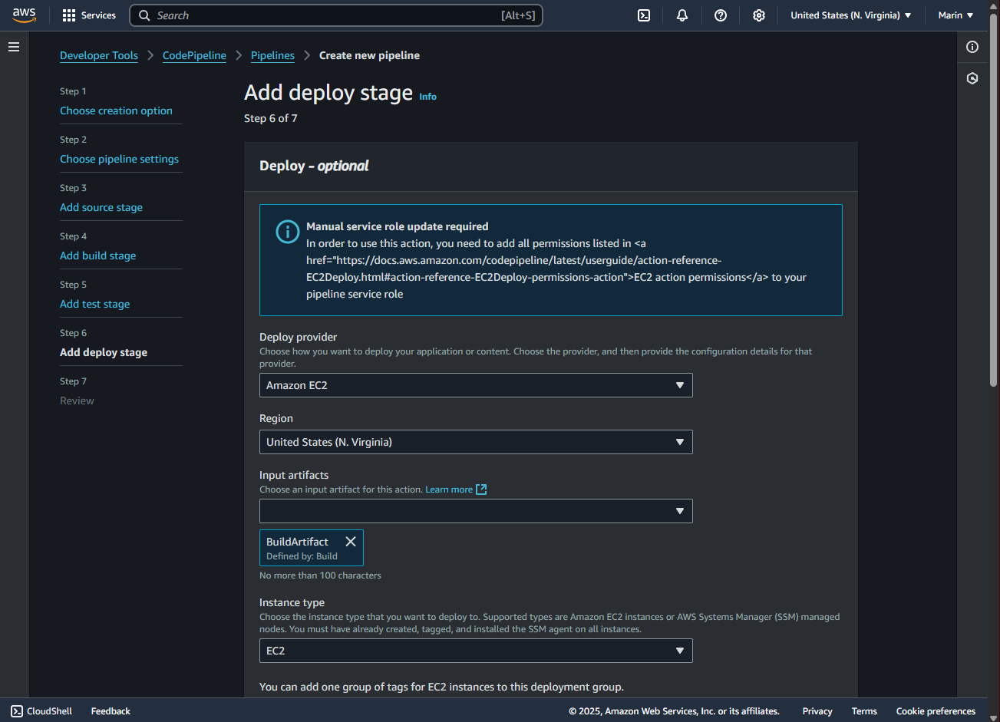

Below we need to select `EC2` again as `Instance Type`, then we need to select our EC2 instance by matching the tags, we can use the one we created earlier or the default `Name` key and `Value` (The name we select for our EC2)

In `Deployspec` select `Use a DeploySpec file`, this is going to be a file that the Deploy Stage is going to use to know what to do once the artifact reaches it.

Inside the input of DeploySpec be sure to add the name of the file that Deploy is going to look for, for this, we will leave it default `appspec.yml`

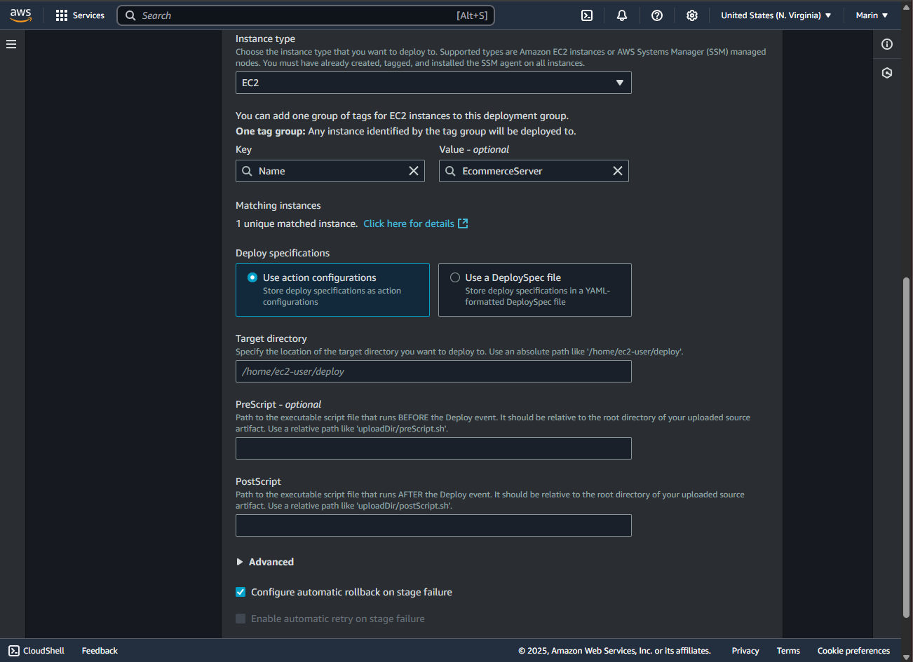

Now that we selected DeploySpec file, we need to create this file in our root folder in the repo, this way we make sure the Build Phase has access to it and it passes it to the Deploy Phase.

Go to your repository and in the `ROOT` folder create a file called `appspec.yml` and paste the following code:

```BASH
version: 0.0

files:
  - source: /
    destination: /var/www/html/ecommerce

hooks:
  BeforeDeploy:
    - location: scripts/before_deploy
      timeout: 60
      runas: ubuntu
```

This simple command tells the Deploy stage to put the built result in /var/www/html/ecommerce (Where NGIGX expects the app to be).

---
#### Bug fix for Deployment
For some reason, while I developed this project my Deploy phase in the pipeline always failed because it expected a `before-deploy` script, even if we never specified it and I could not got my head around it.

So as a last restort fix I gave the Deploy what it wanted, a 'before-deploy' script, this does nothing more than echoing something in the console, but this way I avoid the error of 'not having a script' that prevented me from deploying the app.

So to implement this fix you already set half of it above (The hooks part wasn't orignally planned).

So now create a folder in the root of the repository called `scripts` and inside of it create a `before_deploy.sh` and put the following inside:

```BASH
echo "Before Deploy. . ."
exit 0
```
Now the deploy phase gets what it 'expects' for some reason and it allow the deployment.

---

Make sure to include these files in the repository.

Now in step 7 verify that all our changes are setup properly.

At this point, the files we created should be in the remote repository already, because after the creation of the pipeline, it will attempt to run the process.